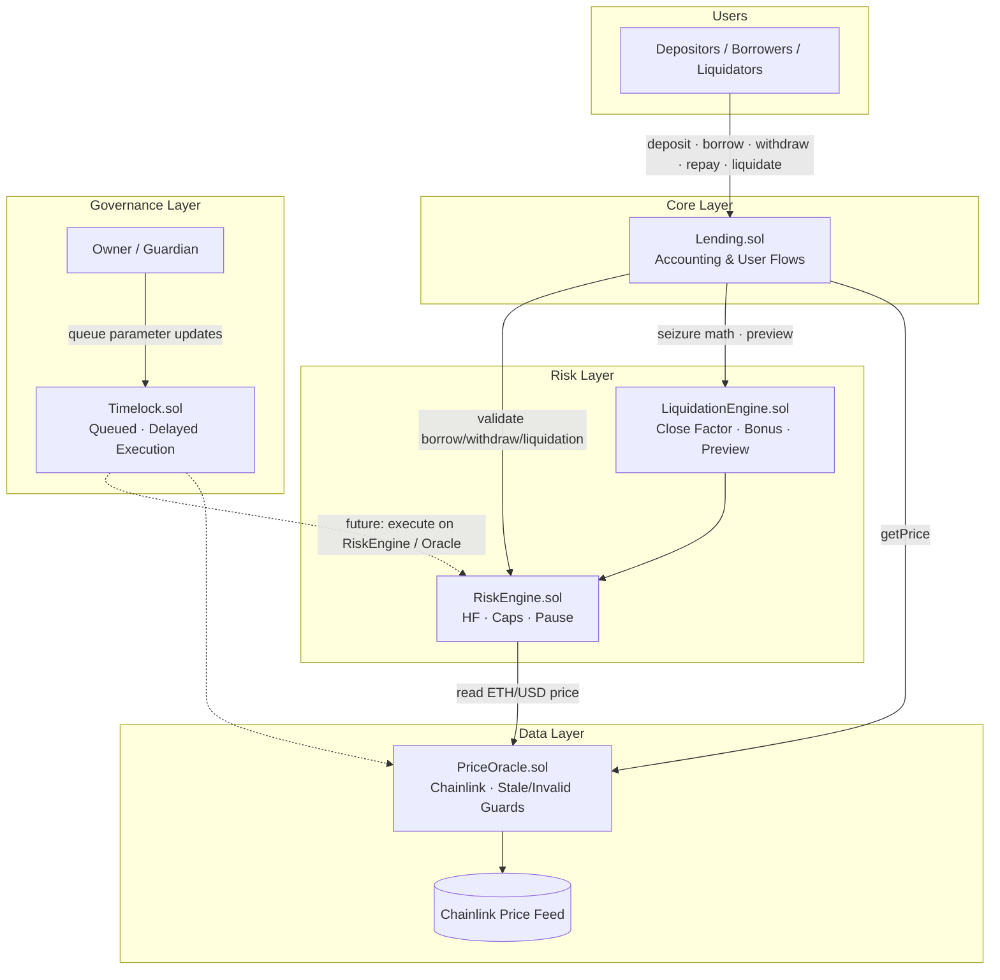

# Lending Protocol

[](https://soliditylang.org/)
[](https://book.getfoundry.sh/)
[](https://chain.link/)
[](https://www.openzeppelin.com/contracts)
[](https://github.com/TheNomiff/lending-protocol/actions/workflows/test.yml)
[](https://opensource.org/licenses/MIT)

**Nomiff Lending Protocol** is an ETH-collateralized, overcollateralized lending system built for modularity, risk isolation, and governance-ready upgrades. Core user accounting lives in `Lending.sol`; solvency rules, caps, and emergency controls are enforced by a dedicated **Risk Engine**; collateral valuation is sourced from **Chainlink** via a hardened **Price Oracle**.

> ## Current Status

See [`docs/LENDING_PROTOCOL.md`](docs/LENDING_PROTOCOL.md) for the authoritative module status and roadmap.

**Summary:**

| Module | Status |
| :--- | :--- |
| Lending (v1) | ✅ Complete |
| Interest | ✅ Complete |
| PriceOracle (Phase 1) | ✅ Complete |
| RiskEngine V3 | ✅ Complete |
| Timelock V1 | ✅ Complete · production wiring 🟡 |
| LiquidationEngine | Phases 1–3 ✅ · Lending integration 🟡 |
| Multi-Asset | ⬜ Planned |

**Not audited. Not production ready.**
---

## Table of Contents

- [Overview](#overview)
- [Architecture](#architecture)
- [Features](#features)
- [Repository Structure](#repository-structure)
- [Protocol Flow](#protocol-flow)
- [Risk Engine](#risk-engine)
- [Governance](#governance)
- [Testing](#testing)
- [Roadmap](#roadmap)
- [Security](#security)
- [Future Upgrades](#future-upgrades)
- [Getting Started](#getting-started)
- [Deployment](#deployment)
- [Documentation](#documentation)
- [Contributing](#contributing)
- [License](#license)

---

## Overview

Nomiff Lending Protocol enables users to:

1. **Deposit** ETH as collateral  
2. **Borrow** against that collateral under LTV and health-factor constraints  
3. **Accrue** fixed-rate interest on outstanding debt  
4. **Repay** debt (with overpayment refund handling)  
5. **Withdraw** collateral when positions remain solvent  
6. **Liquidate** undercollateralized positions with close-factor and bonus rules  

Design goals prioritize **separation of concerns**: `Lending.sol` handles ledger accounting and user flows; `RiskEngine.sol` centralizes risk math and policy; `PriceOracle.sol` owns external price integrity; `Timelock.sol` provides delayed execution for privileged changes.

---

## Architecture

### System Diagram



### Design Principles

| Principle | Implementation |
| :--- | :--- |
| **Risk isolation** | All solvency, cap, and pause checks delegate to `RiskEngine` |
| **Oracle hardening** | Stale-price windows, invalid-price guards, and owner-controlled pause |
| **Modularity** | Swappable oracle and risk modules without rewriting core accounting |
| **Governance readiness** | `Timelock` queues privileged calls with a fixed delay before execution |
| **Extensibility** | Architecture supports future multi-asset markets, liquidation engines, and keepers |

### Contract Responsibilities

| Contract | Role |
| :--- | :--- |
| `Lending.sol` | User-facing deposit, borrow, withdraw, repay, liquidate; supply/borrow totals; interest accrual |
| `RiskEngine.sol` | Health factor, borrow/withdraw validation, liquidation eligibility, caps, emergency pause |
| `LiquidationEngine.sol` | Close factor, liquidation bonus, seizure math, preview |
| `PriceOracle.sol` | Chainlink integration, staleness checks, pause, feed updates |
| `Timelock.sol` | Queue, delay, execute, and cancel governance transactions |

---

## Features

| Module | Capability | Status |
| :--- | :--- | :---: |
| **Lending** | ETH collateral deposits | ✅ |
| **Lending** | Collateralized borrowing | ✅ |
| **Lending** | Collateral withdrawal with solvency checks | ✅ |
| **Lending** | Debt repayment & overpay refunds | ✅ |
| **Lending** | Fixed-rate interest accrual | ✅ |
| **Lending** | Liquidation with bonus distribution | ✅ |
| **Lending** | Supply & borrow accounting | ✅ |
| **Oracle** | Chainlink `AggregatorV3` integration | ✅ |
| **Oracle** | Stale price protection | ✅ |
| **Oracle** | Invalid price protection | ✅ |
| **Oracle** | Pause & feed update controls | ✅ |
| **Risk Engine** | Health factor calculations | ✅ |
| **Risk Engine** | Borrow & withdraw validation | ✅ |
| **Risk Engine** | Liquidation eligibility (`isLiquidatable`) | ✅ |
| **Risk Engine** | Close factor & liquidation bonus | Moved to `LiquidationEngine` |
| **Risk Engine** | Supply & borrow caps | ✅ |
| **Risk Engine** | Guardian emergency pause | ✅ |
| **Risk Engine** | Owner parameter updates | ✅ |
| **Governance** | Timelock queue / execute / cancel | ✅ |
| **Governance** | Timelock ↔ RiskEngine wiring | 🟡 Planned |
| **Testing** | Unit test suite | ✅ |
| **Testing** | Fuzz tests | 🟡 Expanding |
| **Testing** | Invariant tests | 🟡 Expanding |

---

## Repository Structure

```
lending-protocol/
├── src/
│   ├── Lending.sol               # Core lending & liquidation accounting
│   ├── oracle/
│   │   └── PriceOracle.sol       # Chainlink price feeds & safety checks
│   ├── engines/
│   │   │── RiskEngine.sol        # Risk validation, caps, pause (V3)
│   │   └── LiquidationEngine.sol # Liquidation validation, liquidation preview
│   └── governance/
│       └── Timelock.sol          # Delayed governance execution
├── test/
│   ├── unit/                     # Action-level & RiskEngine tests
│   ├── fuzz/                     # Bounded input property tests
│   ├── invariant/                # Stateful protocol invariants
│   └── utils/                    # Shared test bases & handlers
├── docs/
│   ├── LENDING_PROTOCOL.md       # Master architecture & roadmap
│   ├── MULTI_ASSET_LENDING.md    # Multi-asset migration blueprint
│   ├── LIQUIDATION_ENGINE.md     # Liquidation Engine specification
│   ├── PRICE_ORACLE.md           # Price Oracle specification
│   ├── RISK_ENGINE.md            # Risk Engine V3 specification
│   └── TIMELOCK.md               # Governance timelock design
├── lib/                          # forge-std, OpenZeppelin, Chainlink
├── .github/workflows/test.yml    # CI: fmt, build, test
└── foundry.toml                  # Remappings & compiler profile
```

---

## Protocol Flow

### 1. Deposit

A user sends ETH to `deposit()`. The protocol credits `user.deposited`, increases `totalSupply` and `totalLiquidity`, and enforces supply-cap limits via the Risk Engine. Deposits may be blocked when the deposit pause flag is active.

### 2. Borrow

`borrow(amount)` accrues interest on any existing debt, then validates:

- Sufficient protocol liquidity (`totalLiquidity`)
- Borrow cap headroom
- Post-borrow health factor ≥ `minHealthFactor` (via Risk Engine + oracle price)

On success, ETH is transferred to the borrower and borrow totals are updated.

### 3. Interest Accrual

Debt uses a **fixed annual rate** (`INTEREST_RATE = 5%`) applied per second to outstanding principal. Each borrow-touching action calls internal accrual so `borrowed` reflects principal + accrued interest before new risk checks run.

### 4. Repay

`repay()` accepts ETH payment toward outstanding debt. Overpayments are refunded to the user. Repay updates borrow accounting and may restore a previously unhealthy position to solvency.

### 5. Withdraw

`withdraw(amount)` accrues interest, then asks the Risk Engine whether the remaining collateral supports the position at the current oracle price. Withdrawals revert if they would break the minimum health factor or if deposits are paused.

### 6. Liquidation

When `healthFactor < 1e18`, a liquidator may call `liquidate(user, debtToCover)`:

1. Accrue borrower interest  
2. Confirm liquidatability via Risk Engine  
3. Cap repayment by **close factor** (max % of debt per tx)  
4. Transfer debt repayment from liquidator  
5. Seize collateral = repaid debt + **liquidation bonus** (in ETH terms at oracle price)  
6. Require strictly improved health factor post-liquidation  

Liquidations respect the liquidation pause flag and global borrow/supply invariants.

### Health Factor (Conceptual)

```
healthFactor = (collateralValue × liquidationThreshold) / debtValue
```

Where values are derived from oracle-priced ETH collateral and outstanding debt (including accrued interest). Positions must stay above `minHealthFactor` for borrows and withdrawals; liquidations trigger when HF falls below the liquidation threshold scale.

---

## Risk Engine

`RiskEngine.sol` (V3) is the **policy layer** between user intent and protocol state changes. `Lending.sol` never embeds LTV or liquidation math directly — it queries the engine before mutating balances.

### Core Responsibilities

- **Solvency:** Real-time health factor from collateral, debt, and threshold parameters  
- **Validation:** `canBorrow`, `canWithdraw`, `isLiquidatable` gates  
- **Protocol limits:** Global `supplyCap` and `borrowCap`  
- **Emergency response:** Guardian-triggered pause on deposits, borrows, or liquidations  
- **Administration:** Owner updates to ratios, thresholds, and caps  

Close factor and liquidation bonus live in `LiquidationEngine.sol` — see [`docs/LIQUIDATION_ENGINE.md`](docs/LIQUIDATION_ENGINE.md).

### Default Risk Parameters (Configurable)

| Parameter | Default | Module | Purpose |
| :--- | ---: | :--- | :--- |
| `maxBorrowRatio` | 50% | RiskEngine | Max borrow power vs collateral value |
| `liquidationThreshold` | 75% | RiskEngine | Collateral weighting in HF numerator |
| `closeFactor` | 50% | LiquidationEngine | Max debt liquidated per transaction |
| `liquidationBonus` | 10% | LiquidationEngine | Liquidator incentive on seized collateral |
| `minHealthFactor` | 1e18 | RiskEngine | Minimum HF to borrow or withdraw safely |

See [`docs/RISK_ENGINE.md`](docs/RISK_ENGINE.md) for the full V3 specification, formulas, and role matrix.

---

## Governance

`Timelock.sol` enforces a **minimum 1-day delay** between queuing and executing privileged transactions. This prevents sudden parameter changes that users cannot react to.

### Flow

```
Owner → queueTransaction(target, data) → wait DELAY → executeTransaction(txId)
                              ↘ cancelTransaction(txId)  (before execution)
```

Each queued entry stores `target`, `calldata`, `executeAfter`, and an `executed` flag. Execution performs a low-level call to the target contract — designed to eventually drive `RiskEngine` and `PriceOracle` admin functions through governance rather than instant owner calls.

**Integration status:** Timelock contract is implemented and documented; wiring admin paths exclusively through the timelock is on the roadmap.

See [`docs/TIMELOCK.md`](docs/TIMELOCK.md) for queue semantics, threat model, and integration examples.

---

## Testing

The suite is organized for progressive assurance — from isolated unit behavior to stateful invariants.

| Layer | Location | Focus |
| :--- | :--- | :--- |
| **Unit** | `test/unit/` | Deposit, borrow, repay, interest, health factor, RiskEngine policies |
| **Fuzz** | `test/fuzz/` | Bounded random inputs on core user actions |
| **Invariant** | `test/invariant/` | Handler-driven state exploration (`LendingHandler`, `LendingInvariants`) |
| **Utilities** | `test/utils/` | `LendingTestBase`, `RiskTestBase` — shared fixtures and mocks |

### Run Tests

```bash
# Full suite
forge test

# Verbose / match contract
forge test -vvv --match-contract RiskEngineTest

# Fuzz runs (default config in foundry.toml)
forge test --match-path test/fuzz/

# Invariants (may take longer)
forge test --match-path test/invariant/

# Format check (same as CI)
forge fmt --check

# Coverage report
forge coverage
```

### CI Pipeline

GitHub Actions (`.github/workflows/test.yml`) on every push and pull request:

1. `forge fmt --check`  
2. `forge build --sizes`  
3. `forge test -vvv`  

Submodules (`forge-std`, OpenZeppelin, Chainlink contracts) are fetched recursively.

---

## Roadmap

| Phase | Scope | Status |
| :--- | :--- | :---: |
| **Phase 1 — Lending** | Deposit, borrow, withdraw, repay | ✅ |
| **Phase 2 — Interest** | Fixed-rate accrual, debt accounting | ✅ |
| **Phase 2.5 — Testing Foundation** | Unit, fuzz, invariant scaffolding | ✅ |
| **Phase 3 — Oracle** | Chainlink, stale/invalid checks, pause | ✅ |
| **Phase 4 — Liquidation** | Health factor, close factor, bonus, modular engine | ✅ Module · 🟡 Lending integration |
| **Phase 5 — Risk Engine** | Modular risk layer, caps, guardian pause | ✅ |
| **Current — Hardening** | Expanded fuzz/invariant, integration, audit prep | 🟡 |
| **Next — Timelock Integration** | Governance-controlled parameter updates | 🟡 |
| **Next — Liquidation E2E** | Constructor wiring, `lending.liquidate()` tests | 🟡 |
| **Next — Multi-Asset** | Per [MULTI_ASSET_LENDING.md](docs/MULTI_ASSET_LENDING.md) | ⬜ |
| **Next — Frontend** | User-facing dApp | ⬜ |
| **Next — Keeper Bots** | Health monitoring & liquidation automation | ⬜ |
| **Next — Security Review** | External audit & remediation | ⬜ |

---

## Security

### Implemented Safeguards

- **ReentrancyGuard** on `Lending` state-changing entrypoints  
- **Oracle:** stale timestamp checks, non-positive price rejection, pause switch  
- **Risk Engine:** pre-flight validation on all value-decreasing user actions  
- **Caps:** global supply and borrow ceilings  
- **Pause:** guardian can halt deposits, borrows, or liquidations independently  
- **Liquidation:** close-factor limits, bonus bounds, post-liquidation HF improvement requirement  

### Known Limitations

- **Single-asset (ETH)** — no isolated per-asset markets yet  
- **Centralized roles** — owner/guardian privileges; timelock not yet sole admin path  
- **No external audit** — not production-ready for mainnet deployment  
- **Fuzz / invariant coverage** — foundational suites exist; depth is actively expanding  

### Reporting

If you discover a vulnerability, please **do not** open a public issue with exploit details. Contact the maintainer privately via GitHub security advisories or repository contact channels. Responsible disclosure is appreciated.

---

## Future Upgrades

Planned evolution paths (see `docs/Phases.txt` for internal tracking):

| Upgrade | Description |
| :--- | :--- |
| **Liquidation Engine** | Extract liquidation rules into `engines/LiquidationEngine.sol` for cleaner upgrades |
| **Multi-Asset Architecture** | Market-based collateral/debt with per-asset LTV, thresholds, and caps |
| **Timelock Integration** | Route all `RiskEngine` / `PriceOracle` admin calls through `Timelock` |
| **Keeper Infrastructure** | Off-chain health monitors and permissionless liquidation bots |
| **Frontend** | Deposit/borrow dashboards, HF indicators, liquidation alerts |
| **Security** | Formal threat model, invariant expansion, third-party audit |

---

## Getting Started

### Prerequisites

- [Foundry](https://book.getfoundry.sh/getting-started/installation) (`forge`, `cast`, `anvil`)
- Git with submodule support

### Clone & Install

```bash
git clone https://github.com/TheNomiff/lending-protocol.git
cd lending-protocol
git submodule update --init --recursive
forge install   # if additional deps are added via forge
```

### Build

```bash
forge build
```

### Local Development

```bash
# Terminal 1 — local chain
anvil

# Terminal 2 — run tests against default profile
forge test -vv
```

### Project Configuration

`foundry.toml` remappings:

```toml
@openzeppelin/contracts/=lib/openzeppelin-contracts/contracts/
@chainlink/contracts/=lib/chainlink-brownie-contracts/contracts/
```

---

## Deployment

> **Note:** Foundry deployment scripts are not yet checked into this repository. Deploy manually or add `script/` targets following the dependency order below.

### Recommended Deploy Order

1. **PriceOracle** — constructor: Chainlink ETH/USD (or network-equivalent) feed address  
2. **RiskEngine** — constructor: `_supplyCap`, `_borrowCap` (non-zero)  
3. **Lending** — wire `PriceOracle` and `RiskEngine` addresses; transfer ownership as needed  
4. **Timelock** — deploy; later transfer `RiskEngine` / `PriceOracle` ownership to timelock  

### Post-Deploy Checklist

- [ ] Verify oracle feed address on target network  
- [ ] Set `staleTime` appropriately for feed heartbeat  
- [ ] Configure risk parameters (`maxBorrowRatio`, thresholds, caps)  
- [ ] Assign distinct **guardian** for emergency pause (not equal to day-to-day admin)  
- [ ] Document deployed addresses per environment  
- [ ] Run full `forge test` against forked mainnet state if applicable  

### Example Cast Interaction (Local Anvil)

```bash
# After deploy — deposit 1 ETH (replace ADDRESS)
cast send <LENDING_ADDRESS> "deposit()" --value 1ether --private-key <KEY>
```

Production deployment guides and verified contract addresses will be published after audit and testnet validation.

---

## Documentation

| Document | Contents |
| :--- | :--- |
| [`docs/LENDING_PROTOCOL.md`](docs/LENDING_PROTOCOL.md) | **Master architecture** — module status, roadmap, checklists |
| [`docs/RISK_ENGINE.md`](docs/RISK_ENGINE.md) | Risk Engine V3 specification |
| [`docs/PRICE_ORACLE.md`](docs/PRICE_ORACLE.md) | Price Oracle blueprint (Phase 1 complete) |
| [`docs/LIQUIDATION_ENGINE.md`](docs/LIQUIDATION_ENGINE.md) | Liquidation Engine blueprint (Phases 1–3 complete) |
| [`docs/TIMELOCK.md`](docs/TIMELOCK.md) | Governance timelock design |
| [`docs/MULTI_ASSET_LENDING.md`](docs/MULTI_ASSET_LENDING.md) | Multi-asset migration blueprint |

---

## Contributing

Contributions are welcome during the hardening phase. Please:

1. **Fork** the repository and create a feature branch from `main`  
2. **Run** `forge fmt`, `forge build`, and `forge test` before opening a PR  
3. **Add tests** for new behavior (unit minimum; fuzz/invariant for risk-critical paths)  
4. **Follow** existing naming, error, and event conventions in `src/`  
5. **Reference** issues or design docs in PR descriptions for non-trivial changes  

### Code Style

- Solidity `^0.8.20`, custom errors over `require` strings  
- Custom errors prefixed by contract name (`Lending__`, `RiskEngine__`, etc.)  
- Keep risk logic out of `Lending.sol` — extend `RiskEngine` instead  

---

## License

This project is licensed under the **MIT License** — see the SPDX identifier in each source file (`// SPDX-License-Identifier: MIT`).

Third-party dependencies (Foundry, OpenZeppelin, Chainlink) are subject to their respective licenses in `lib/`.

---

<p align="center">
  <sub>Built with Foundry · Secured by design, validated by tests</sub>
</p>
