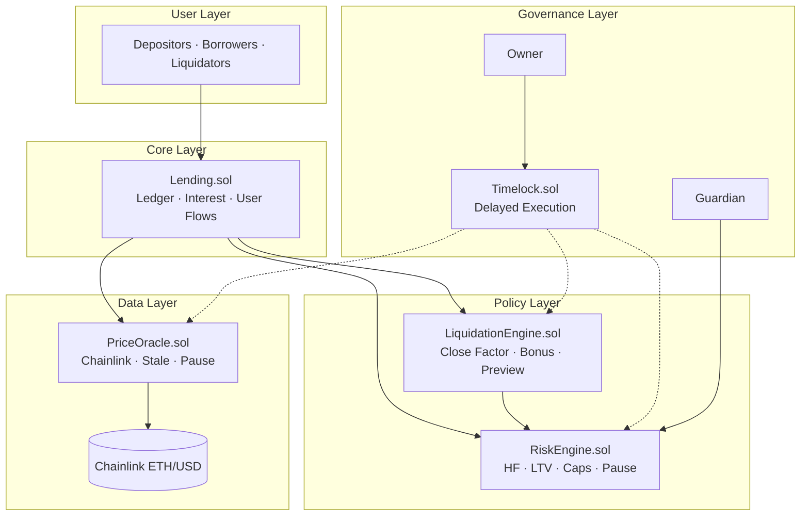
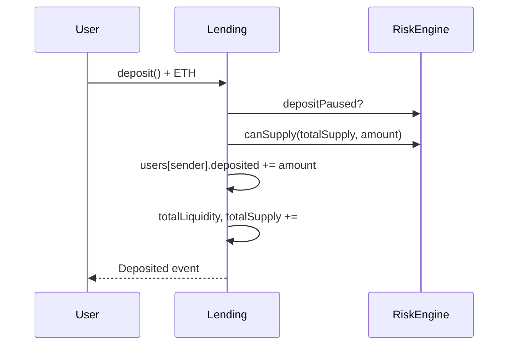
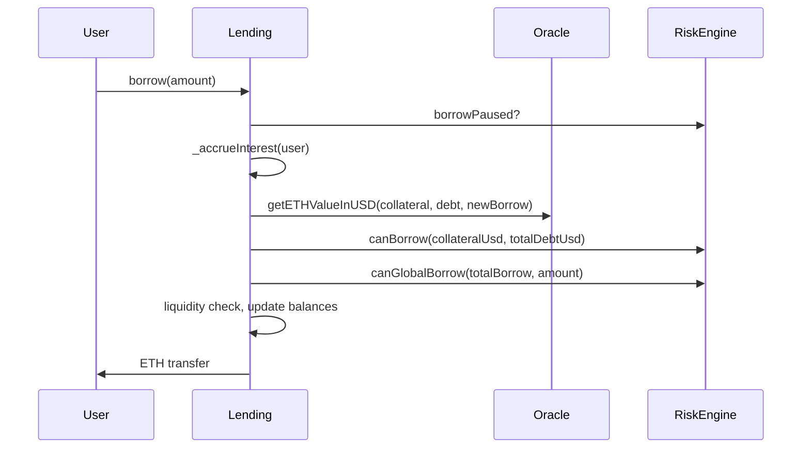
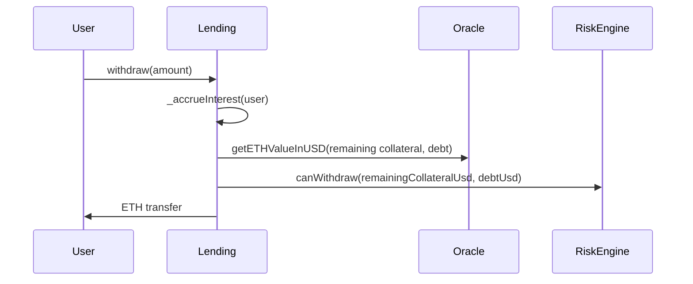
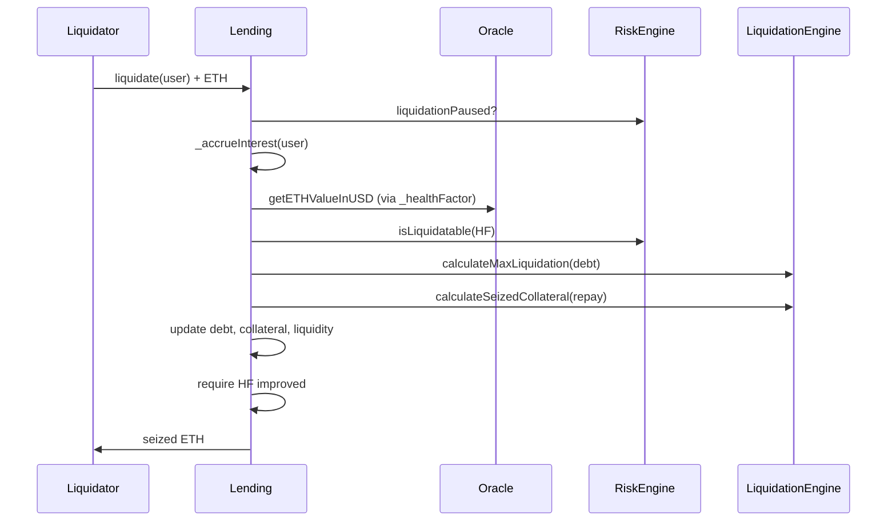
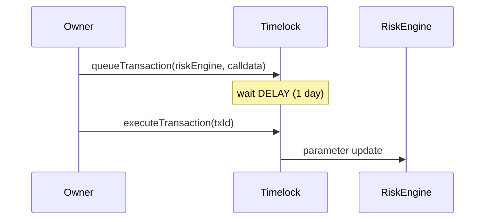
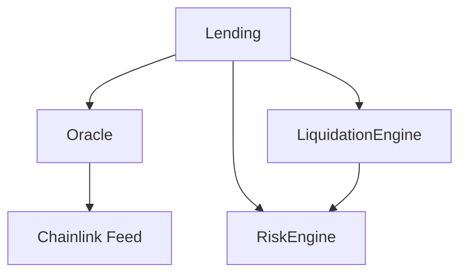
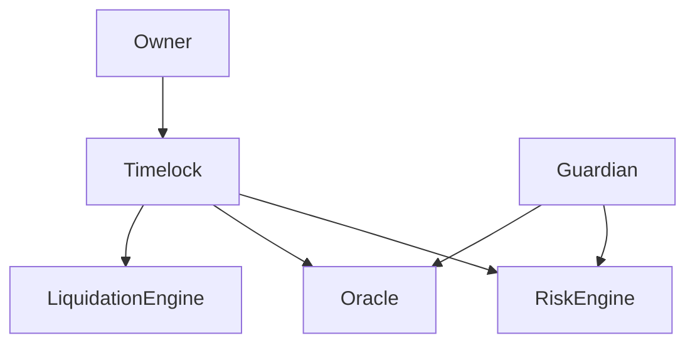
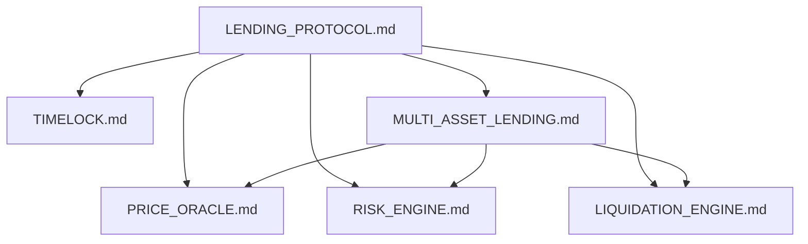

# LANDING Protocol — Master Architecture Document

> **Document role:** Canonical overview of the entire protocol — architecture, module status, roadmap, and documentation index.
>
> **Last synchronized:** June 2026 · aligned with `src/` and `test/` as of this revision.
>
> **Related blueprints:** [PRICE_ORACLE.md](./PRICE_ORACLE.md) · [RISK_ENGINE.md](./RISK_ENGINE.md) · [LIQUIDATION_ENGINE.md](./LIQUIDATION_ENGINE.md) · [TIMELOCK.md](./TIMELOCK.md) · [MULTI_ASSET_LENDING.md](./MULTI_ASSET_LENDING.md)

---

## Table of Contents

1. [Vision](#1-vision)
2. [Protocol Architecture](#2-protocol-architecture)
3. [Current Module Status](#3-current-module-status)
4. [Protocol Flow — Module Interaction](#4-protocol-flow--module-interaction)
5. [Detailed Development Roadmap](#5-detailed-development-roadmap)
6. [Current Progress](#6-current-progress)
7. [Future Protocol Evolution](#7-future-protocol-evolution)
8. [Module Dependency Diagrams](#8-module-dependency-diagrams)
9. [Testing Strategy](#9-testing-strategy)
10. [Audit Readiness Checklist](#10-audit-readiness-checklist)
11. [Production Readiness Checklist](#11-production-readiness-checklist)
12. [Documentation Index](#12-documentation-index)
13. [Document Maintenance](#13-document-maintenance)

---

## 1. Vision

LANDING Protocol is a **modular, overcollateralized lending system** built on Ethereum. It is designed to evolve from a focused single-asset MVP into a **production-grade multi-asset money market** with institutional risk controls, delayed governance, automated liquidation, and audit-ready assurance.

### Design Goals

| Goal | How It Is Achieved |
| :--- | :--- |
| **Security by separation** | Accounting (`Lending`), policy (`RiskEngine`), pricing (`PriceOracle`), liquidation math (`LiquidationEngine`), and governance (`Timelock`) are distinct contracts |
| **Fail-closed risk** | Oracle staleness, invalid prices, and pause states revert user operations rather than proceeding with unsafe assumptions |
| **Incremental evolution** | Each roadmap phase ships with tests and documented completion criteria before the next phase begins |
| **Governance safety** | Sensitive parameter changes route through `Timelock` delay windows |
| **Multi-asset readiness** | Events, module boundaries, and [MULTI_ASSET_LENDING.md](./MULTI_ASSET_LENDING.md) blueprint prepare the ETH-only MVP for market-based architecture |

### What the Protocol Does Today

Users can **deposit native ETH**, **borrow ETH** against that collateral, **accrue fixed-rate interest**, **repay debt**, **withdraw collateral** when solvent, and **liquidate unhealthy positions** — with solvency enforced by `RiskEngine` and pricing by Chainlink via `PriceOracle`.

### What Comes Next

Multi-asset reserves, cross-asset liquidation, utilization-based rates, isolation mode, E-Mode, frontend, keeper bots, and external audit — sequenced in [Section 5](#5-detailed-development-roadmap).

---

## 2. Protocol Architecture

### 2.1 Layer Model



### 2.2 Contract Responsibilities

| Contract | Path | Responsibility |
| :--- | :--- | :--- |
| **Lending** | `src/Lending.sol` | User ledger; deposit, borrow, withdraw, repay, liquidate; interest accrual; global ETH liquidity accounting |
| **RiskEngine** | `src/engines/RiskEngine.sol` | Health factor, borrow/withdraw validation, liquidation eligibility, supply/borrow caps, guardian pause |
| **LiquidationEngine** | `src/engines/LiquidationEngine.sol` | Close factor, liquidation bonus, seizure math, validation helpers, liquidation preview |
| **PriceOracle** | `src/oracle/PriceOracle.sol` | Chainlink feed integration, ETH/USD conversion, staleness and pause guards |
| **Timelock** | `src/governance/Timelock.sol` | Queue, delay, execute, cancel privileged transactions |

### 2.3 Accounting Model (Current — Single Asset)

```text
struct User {
    uint256 deposited;           // ETH collateral (wei)
    uint256 borrowed;            // debt + accrued interest (wei)
    uint256 lastBorrowTimestamp; // interest anchor
}

Global: totalLiquidity · totalSupply · totalBorrow
Interest: 5% fixed APR (INTEREST_RATE = 5e16)
Native asset: ETH via msg.value / call{value:}
```

### 2.4 Risk Stack (Current)

```text
collateralUsd = oracle.getETHValueInUSD(user.deposited)
debtUsd       = oracle.getETHValueInUSD(user.borrowed + pendingInterest)
HF            = riskEngine.healthFactor(collateralUsd, debtUsd)

Borrow allowed when:  debtUsd <= maxBorrowUsd  (maxBorrowRatio default 50%)
Liquidatable when:    HF < minHealthFactor     (default 1e18 = 1.0)
```

### 2.5 Known Integration Gaps

| Gap | Impact | Target Phase |
| :--- | :--- | :--- |
| `liquidationEngine` not set in `Lending` constructor | Production deploy must wire manually or liquidations revert | Phase 6 completion |
| No end-to-end `lending.liquidate()` integration tests | Liquidation path less verified at ledger level | Phase 6 completion |
| Timelock not sole admin on mainnet deploy | Owner can still change params instantly if ownership not transferred | Phase 5 completion |
| Liquidation does not decrement `totalSupply` | Global supply diverges after liquidations | Phase 6 / multi-asset migration |

These are documented blockers for mainnet production readiness.

---

## 3. Current Module Status

### 3.1 Summary Table

| Module | Status | Blueprint |
| :--- | :--- | :--- |
| **Lending** | ✅ Completed (v1) | This document |
| **Interest** | ✅ Completed | This document · `Lending.sol` |
| **PriceOracle** | ✅ Completed (Phase 1) | [PRICE_ORACLE.md](./PRICE_ORACLE.md) |
| **RiskEngine** | ✅ Completed (V3) | [RISK_ENGINE.md](./RISK_ENGINE.md) |
| **Timelock** | ✅ Completed (V1 contract) | [TIMELOCK.md](./TIMELOCK.md) |
| **LiquidationEngine** | 🟡 Phases 1–3 complete · integration in progress | [LIQUIDATION_ENGINE.md](./LIQUIDATION_ENGINE.md) |
| **Multi-Asset** | ⬜ Planned | [MULTI_ASSET_LENDING.md](./MULTI_ASSET_LENDING.md) |

### 3.2 Lending

**Status:** ✅ Completed (v1)

| Feature | State |
| :--- | :---: |
| Native ETH deposit | ✅ |
| Collateralized borrow | ✅ |
| Withdraw with solvency check | ✅ |
| Repay with overpayment refund | ✅ |
| Liquidation execution path | ✅ |
| ReentrancyGuard on entrypoints | ✅ |
| Event hooks with `token` param (`address(0)` = ETH) | ✅ |

### 3.3 Interest Engine

**Status:** ✅ Completed

| Feature | State |
| :--- | :---: |
| Fixed 5% APR | ✅ |
| Per-second accrual | ✅ |
| Lazy accrual on borrow/withdraw/repay/liquidate | ✅ |
| `getTotalDebt` / `calculateInterest` views | ✅ |

### 3.4 PriceOracle

**Status:** ✅ Completed (Oracle Phase 1 — single ETH/USD feed)

| Feature | State |
| :--- | :---: |
| Chainlink `AggregatorV3` integration | ✅ |
| `getETHValueInUSD` / `getUSDToETH` | ✅ |
| Staleness protection | ✅ |
| Invalid price rejection | ✅ |
| Owner pause / feed update | ✅ |
| Multi-asset feed registry | ⬜ Phase 2+ in [PRICE_ORACLE.md](./PRICE_ORACLE.md) |

### 3.5 RiskEngine

**Status:** ✅ Completed (V3)

| Feature | State |
| :--- | :---: |
| Health factor calculation | ✅ |
| `canBorrow` / `canWithdraw` | ✅ |
| `isLiquidatable` | ✅ |
| Global supply/borrow caps | ✅ |
| Guardian pause (deposit/borrow/liquidation) | ✅ |
| Owner parameter updates | ✅ |
| Per-asset risk params | ⬜ Phase 7+ via [MULTI_ASSET_LENDING.md](./MULTI_ASSET_LENDING.md) |

> **Note:** `closeFactor` and `liquidationBonus` live in `LiquidationEngine`, not `RiskEngine`.

### 3.6 Timelock

**Status:** ✅ Completed (V1 contract + unit tests)

| Feature | State |
| :--- | :---: |
| Queue / execute / cancel | ✅ |
| Fixed delay (`DELAY = 1 days`) | ✅ |
| Unit test coverage | ✅ |
| Sole admin path for RiskEngine / Oracle / LiquidationEngine on production | 🟡 In progress |
| On-chain proposal / voting | ⬜ Future |

### 3.7 LiquidationEngine

**Status:** Module phases 1–3 complete · **Lending integration in progress**

| Module Phase | Deliverable | Status |
| :--- | :--- | :---: |
| **Phase 1** | Calculation functions, static parameters, unit tests | ✅ |
| **Phase 2** | Validation helpers (`canLiquidate`, `remainingDebt`, `remainingCollateral`) | ✅ |
| **Phase 3** | `previewLiquidation` for UX and bots | ✅ |
| **Phase 4** | Multi-asset oracle-based seizure | ⏳ |
| **Phase 5** | Dynamic close factor / bonus curves | ⏳ |
| **Phase 6** | Batch liquidation, keeper integration | ⏳ |

**Integration status:**

| Item | State |
| :--- | :---: |
| `LiquidationEngine.sol` implemented | ✅ |
| Unit tests (`test/unit/liquidation/`) | ✅ |
| Wired in `Lending` constructor | ⬜ |
| End-to-end `Lending.liquidate()` tests | ⬜ |
| `previewLiquidation` used by `Lending` | ⬜ |

See [LIQUIDATION_ENGINE.md](./LIQUIDATION_ENGINE.md) for module-level detail.

---

## 4. Protocol Flow — Module Interaction

### 4.1 End-to-End Request Flow

```text
User
  ↓
Lending.sol          ← accounting · interest · asset transfers
  ↓
PriceOracle.sol      ← ETH → USD for all solvency comparisons
  ↓
RiskEngine.sol       ← HF · LTV · caps · pause gates
  ↓
LiquidationEngine.sol ← close factor · bonus · seizure · preview (liquidation only)
  ↓
Timelock.sol         ← delayed admin (not in user hot path)
```

### 4.2 Deposit Flow



### 4.3 Borrow Flow



### 4.4 Withdraw Flow



### 4.5 Liquidation Flow



### 4.6 Governance Flow



---

## 5. Detailed Development Roadmap

Each phase lists **objective**, **features**, **dependencies**, and **completion criteria**. Phases are sequential unless noted.

---

### Phase 1 — Single-Asset Lending

| | |
| :--- | :--- |
| **Objective** | Deliver core ETH collateral lending: deposit, borrow, withdraw, repay |
| **Features** | Native ETH transfers; `User` struct ledger; `totalLiquidity` / `totalSupply` / `totalBorrow`; ReentrancyGuard; multi-asset-ready events |
| **Dependencies** | None |
| **Completion criteria** | All user flows implemented; unit tests for happy/revert paths; CI green |
| **Status** | ✅ Complete |

---

### Phase 2 — Interest Engine

| | |
| :--- | :--- |
| **Objective** | Time-based debt accrual with fixed APR |
| **Features** | `INTEREST_RATE = 5%`; per-second rate; lazy accrual; `lastBorrowTimestamp`; view helpers |
| **Dependencies** | Phase 1 |
| **Completion criteria** | Interest tests; debt grows correctly over time; accrual on all debt-touching actions |
| **Status** | ✅ Complete |

---

### Phase 3 — Oracle

| | |
| :--- | :--- |
| **Objective** | Trustworthy ETH/USD pricing for all solvency decisions |
| **Features** | Chainlink integration; staleness window; invalid price guards; pause; `getETHValueInUSD` |
| **Dependencies** | Phase 1 |
| **Completion criteria** | Oracle unit tests; fail-closed on stale/paused/invalid; [PRICE_ORACLE.md](./PRICE_ORACLE.md) Phase 1 complete |
| **Status** | ✅ Complete |

---

### Phase 4 — Risk Engine

| | |
| :--- | :--- |
| **Objective** | Isolate solvency policy from ledger accounting |
| **Features** | HF math; `canBorrow` / `canWithdraw`; `isLiquidatable`; supply/borrow caps; guardian pause; owner params |
| **Dependencies** | Phase 3 (USD inputs from Lending) |
| **Completion criteria** | RiskEngine unit tests; Lending delegates all policy checks; [RISK_ENGINE.md](./RISK_ENGINE.md) V3 complete |
| **Status** | ✅ Complete |

---

### Phase 5 — Governance (Timelock)

| | |
| :--- | :--- |
| **Objective** | Delay privileged parameter changes so users can react |
| **Features** | `Timelock.sol`; queue / execute / cancel; 1-day delay; ownership transfer pattern |
| **Dependencies** | Phase 4 |
| **Completion criteria** | Timelock unit tests; documented integration path; production ownership transferred to Timelock |
| **Status** | ✅ Contract complete · 🟡 Production wiring in progress |

---

### Phase 6 — Liquidation Engine

| | |
| :--- | :--- |
| **Objective** | Modular liquidation policy; preview for bots; full Lending integration |
| **Features** | `LiquidationEngine.sol`; close factor; bonus; seizure math; validation helpers; `previewLiquidation`; constructor wiring in Lending; E2E liquidation tests |
| **Dependencies** | Phase 4, Phase 5 |
| **Completion criteria** | Module phases 1–3 tested; Lending constructor wires engine; E2E liquidate tests; `totalSupply` accounting fix |
| **Status** | 🟡 Module phases 1–3 ✅ · Integration ⏳ · Phases 4–6 ⏳ |

---

### Phase 7 — Multi-Asset Lending

| | |
| :--- | :--- |
| **Objective** | Transition from single ETH pool to market-based multi-asset reserves |
| **Features** | Asset registry; nested user mappings; ERC-20 deposit/borrow; per-reserve accounting |
| **Dependencies** | Phase 6 integration complete |
| **Completion criteria** | [MULTI_ASSET_LENDING.md](./MULTI_ASSET_LENDING.md) Phases 1–4 complete; regression tests pass |
| **Status** | ⬜ Planned |

---

### Phase 8 — Cross-Asset Liquidation

| | |
| :--- | :--- |
| **Objective** | Liquidate heterogeneous debt/collateral (e.g., repay USDC, seize ETH) |
| **Features** | Multi-asset oracle pricing; cross-asset seizure formula; liquidator-chosen collateral |
| **Dependencies** | Phase 7; [PRICE_ORACLE.md](./PRICE_ORACLE.md) Phase 2–3; [MULTI_ASSET_LENDING.md](./MULTI_ASSET_LENDING.md) Phases 5–7 |
| **Completion criteria** | Cross-asset liquidation E2E tests; HF improvement invariant holds |
| **Status** | ⬜ Planned |

---

### Phase 9 — Protocol Fees

| | |
| :--- | :--- |
| **Objective** | Protocol revenue from lending activity |
| **Features** | Flash loan fees; origination fees (optional); treasury accumulator |
| **Dependencies** | Phase 7 |
| **Completion criteria** | Fee params governance-controlled; treasury accounting tested |
| **Status** | ⬜ Planned |

---

### Phase 10 — Reserve Factor

| | |
| :--- | :--- |
| **Objective** | Split borrow interest between suppliers and protocol treasury |
| **Features** | Reserve factor per asset; `accruedToTreasury`; supply yield via liquidity index |
| **Dependencies** | Phase 7; Phase 9 |
| **Completion criteria** | Index-based accrual; treasury withdraw path; [MULTI_ASSET_LENDING.md](./MULTI_ASSET_LENDING.md) Phase 8 partial |
| **Status** | ⬜ Planned |

---

### Phase 11 — Isolation Mode

| | |
| :--- | :--- |
| **Objective** | Limit risk exposure for newly listed volatile collateral |
| **Features** | Debt ceiling per isolated asset; restricted borrow set |
| **Dependencies** | Phase 7, Phase 8 |
| **Completion criteria** | Isolation mode E2E tests; cannot cross-collateralize isolated positions |
| **Status** | ⬜ Planned |

---

### Phase 12 — Efficiency Mode (E-Mode)

| | |
| :--- | :--- |
| **Objective** | Higher LTV for correlated asset categories (e.g., stables, ETH LSTs) |
| **Features** | Category definitions; user opt-in; override LTV/threshold |
| **Dependencies** | Phase 7, Phase 6 (portfolio HF) |
| **Completion criteria** | E-Mode enable/disable tests; HF checks use category params |
| **Status** | ⬜ Planned |

---

### Phase 13 — Frontend

| | |
| :--- | :--- |
| **Objective** | User-facing dApp for protocol interaction |
| **Features** | Deposit/borrow dashboard; HF indicator; transaction builder; wallet connect |
| **Dependencies** | Stable core API (Phase 6+ integration) |
| **Completion criteria** | Testnet UX complete; reads on-chain state via views/events |
| **Status** | ⬜ Planned |

---

### Phase 14 — Automation Bots

| | |
| :--- | :--- |
| **Objective** | Permissionless liquidation and health monitoring |
| **Features** | Keeper using `previewLiquidation`; alerting; batch liquidation API (future) |
| **Dependencies** | Phase 6 Phase 3 preview; Phase 8 for cross-asset |
| **Completion criteria** | Reference keeper bot; documented runbook |
| **Status** | ⬜ Planned |

---

### Phase 15 — Security Hardening

| | |
| :--- | :--- |
| **Objective** | Deepen assurance beyond unit tests |
| **Features** | Expanded fuzz/invariant suites; adversarial contracts; fork tests; threat model doc |
| **Dependencies** | Ongoing from Phase 2.5 |
| **Completion criteria** | Defined invariant set enforced in CI; fuzz run count thresholds |
| **Status** | 🟡 In progress |

---

### Phase 16 — Audit Preparation

| | |
| :--- | :--- |
| **Objective** | External audit readiness and remediation workflow |
| **Features** | Audit scope doc; known issues resolved; deployment checklist; bug bounty prep |
| **Dependencies** | Phase 6 integration; Phase 15 hardening |
| **Completion criteria** | Audit Readiness Checklist (Section 10) complete; third-party audit engaged |
| **Status** | ⬜ Planned |

---

## 6. Current Progress

### ✅ Completed

| Area | Details |
| :--- | :--- |
| Single-asset lending | Deposit, borrow, withdraw, repay |
| Interest accrual | Fixed 5% APR, lazy accrual |
| PriceOracle Phase 1 | ETH/USD Chainlink, stale/pause guards |
| RiskEngine V3 | HF, LTV, caps, guardian pause |
| Timelock V1 | Contract + full unit tests |
| LiquidationEngine Phases 1–3 | Calculations, validation helpers, preview |
| Testing foundation | Unit tests for all modules; fuzz baseline; invariant scaffold |
| CI pipeline | fmt, build, test on every PR |

### 🟡 In Progress

| Area | Details |
| :--- | :--- |
| LiquidationEngine ↔ Lending integration | Constructor wiring, E2E liquidate tests |
| Timelock production integration | Transfer module ownership; route admin via queue |
| Security hardening | Expanded fuzz/invariant coverage |
| Accounting fixes | `totalSupply` on liquidation; document known gaps |

### ⬜ Planned

| Area | Details |
| :--- | :--- |
| Multi-asset architecture | [MULTI_ASSET_LENDING.md](./MULTI_ASSET_LENDING.md) |
| Cross-asset liquidation | LiquidationEngine Phase 4+ |
| Multi-asset oracle | [PRICE_ORACLE.md](./PRICE_ORACLE.md) Phase 2+ |
| Protocol fees & reserve factor | Phases 9–10 |
| Isolation Mode & E-Mode | Phases 11–12 |
| Frontend & keeper bots | Phases 13–14 |
| External audit | Phase 16 |

---

## 7. Future Protocol Evolution

```mermaid
flowchart LR
    subgraph now [Current]
        ETH[Single Asset ETH]
        MOD[Modular Contracts]
    end

    subgraph next [Near Term]
        LIQINT[Liquidation Integration]
        GOV[Governance Wiring]
        HARD[Security Hardening]
    end

    subgraph mid [Mid Term]
        MULTI[Multi Asset Markets]
        CROSS[Cross Asset Liquidation]
        FEES[Fees and Reserve Factor]
    end

    subgraph long [Long Term]
        ISO[Isolation Mode]
        EMODE[E-Mode]
        UI[Frontend and Bots]
        AUDIT[Audit and Mainnet]
    end

    now --> next
    next --> mid
    mid --> long
```



### Architectural Trajectory

1. **Today:** ETH-only ledger with modular risk, oracle, liquidation math, and timelock.
2. **Next:** Complete liquidation integration and governance wiring; fix known accounting gaps.
3. **Mid-term:** Multi-asset reserves per [MULTI_ASSET_LENDING.md](./MULTI_ASSET_LENDING.md); per-asset oracle feeds; cross-asset liquidation.
4. **Long-term:** Aave-class features (E-Mode, isolation, indexes, flash loans); frontend; keeper network; audited mainnet deployment.

---

## 8. Module Dependency Diagrams

### 8.1 Runtime Dependencies (User Transactions)



### 8.2 Admin / Governance Dependencies



### 8.3 Documentation Dependencies



---

## 9. Testing Strategy

### 9.1 Pyramid

| Layer | Location | Purpose | Status |
| :--- | :--- | :--- | :---: |
| **Unit** | `test/unit/` | Per-function behavior, revert paths | ✅ |
| **Fuzz** | `test/fuzz/` | Bounded random inputs | 🟡 Expanding |
| **Invariant** | `test/invariant/` | Stateful properties over time | 🟡 Expanding |
| **Integration** | `test/integration/` (planned) | Multi-module user journeys | ⬜ |
| **Fork** | `test/fork/` (planned) | Real Chainlink on testnet fork | ⬜ |

### 9.2 Coverage by Module

| Module | Test Path | Notes |
| :--- | :--- | :--- |
| Lending | `test/unit/lending/` | Deposit, borrow, repay, interest, HF — **no liquidate E2E yet** |
| RiskEngine | `test/unit/risk/` | HF, borrow, withdraw, caps, pause, params |
| PriceOracle | `test/unit/oracle/` | Price, stale, pause, conversion, feed |
| LiquidationEngine | `test/unit/liquidation/` | Calc, params, preview, ownership |
| Timelock | `test/unit/timelock/` | Queue, execute, cancel, edge cases |

### 9.3 Critical Properties to Test

| Property | Target |
| :--- | :--- |
| `totalLiquidity == address(lending).balance` | Invariant (ETH) |
| Borrow never exceeds LTV | Fuzz + unit |
| Withdraw never breaks HF | Fuzz + unit |
| Oracle stale → operations revert | Unit |
| Liquidation improves HF | Integration (Phase 6 completion) |
| Timelock delay enforced | Unit |

### 9.4 CI Requirements

Every PR must pass:

```bash
forge fmt --check
forge build --sizes
forge test -vvv
```

---

## 10. Audit Readiness Checklist

Use before engaging an external auditor.

### Code Completeness

- [ ] `LiquidationEngine` wired in `Lending` constructor
- [ ] End-to-end liquidation integration tests
- [ ] `totalSupply` accounting correct on all collateral-reducing paths
- [ ] Timelock is sole admin for RiskEngine, Oracle, LiquidationEngine
- [ ] No known critical/high issues open

### Documentation

- [ ] [LENDING_PROTOCOL.md](./LENDING_PROTOCOL.md) reflects deployed architecture
- [ ] Module blueprints synchronized (oracle, risk, liquidation, timelock, multi-asset)
- [ ] Known limitations documented (single-asset, role centralization)
- [ ] Threat model written (oracle, governance, reentrancy, liquidation)

### Testing

- [ ] Unit coverage for all external functions
- [ ] Fuzz on borrow, withdraw, repay with bounded amounts
- [ ] Invariant suite runs in CI with acceptable run count
- [ ] Fork test against target network Chainlink feed

### Operational

- [ ] Guardian key distinct from owner/timelock proposer
- [ ] Pause runbook documented
- [ ] Deploy addresses documented per environment
- [ ] Incident response process defined

---

## 11. Production Readiness Checklist

Additional items beyond audit for mainnet launch.

### Security

- [ ] External audit completed and findings remediated
- [ ] Bug bounty or responsible disclosure program live
- [ ] Multisig for Timelock proposer (recommended)

### Economics

- [ ] Risk parameters reviewed for target assets
- [ ] Supply/borrow caps set conservatively for launch
- [ ] Liquidation bonus sufficient to attract keepers

### Infrastructure

- [ ] Reference liquidation bot operational on testnet
- [ ] Monitoring / alerting on pause events, cap utilization, HF distribution
- [ ] Frontend or documented cast/ethers interaction path

### Legal / Ops

- [ ] Terms of use / risk disclosures (project-level)
- [ ] On-call rotation for guardian pause decisions

---

## 12. Documentation Index

| Document | Role | Status Sync |
| :--- | :--- | :--- |
| **[LENDING_PROTOCOL.md](./LENDING_PROTOCOL.md)** | Master architecture (this file) | Source of truth for protocol-wide status |
| [PRICE_ORACLE.md](./PRICE_ORACLE.md) | Oracle module blueprint | Phase 1 ✅ · Phases 2–6 ⬜ |
| [RISK_ENGINE.md](./RISK_ENGINE.md) | RiskEngine V3 specification | V3 ✅ |
| [LIQUIDATION_ENGINE.md](./LIQUIDATION_ENGINE.md) | Liquidation module blueprint | Phases 1–3 ✅ · 4–6 ⬜ |
| [TIMELOCK.md](./TIMELOCK.md) | Governance timelock design | V1 ✅ |
| [MULTI_ASSET_LENDING.md](./MULTI_ASSET_LENDING.md) | Multi-asset migration blueprint | All phases ⬜ (blueprint only) |
| [README.md](../README.md) | Repository entry point | Must link here |

---

## 13. Document Maintenance

### Why This File Must Stay Synchronized

This document is the **single source of truth** for protocol-wide implementation status. Module blueprints ([PRICE_ORACLE.md](./PRICE_ORACLE.md), [LIQUIDATION_ENGINE.md](./LIQUIDATION_ENGINE.md), etc.) contain deeper design detail, but **phase completion claims must agree** with this file and with the codebase.

Drift between documents causes:

- Contributors implementing against outdated assumptions
- Auditors scoping the wrong module state
- Users trusting features that are not yet integrated

### When to Update

| Trigger | Action |
| :--- | :--- |
| New contract merged to `src/` | Update [Section 3](#3-current-module-status) and [Section 6](#6-current-progress) |
| Phase completion criteria met | Mark phase ✅ in [Section 5](#5-detailed-development-roadmap) |
| Integration gap closed | Remove from [Section 2.5](#25-known-integration-gaps) |
| New module blueprint section | Cross-link and align status tables in both files |
| Test suite milestone | Update [Section 9](#9-testing-strategy) |
| Pre-audit / pre-mainnet | Refresh Sections 10–11 |

### Update Procedure

1. Verify behavior in `src/` and `test/` — **code is authoritative**.
2. Update this master document first (status tables, progress section).
3. Update affected module blueprint status headers and appendix roadmap tables.
4. Update [README.md](../README.md) status block if user-facing summary changed.
5. Note **Last synchronized** date at the top of each changed file.

### Status Legend (All Docs)

| Symbol | Meaning |
| :--- | :--- |
| ✅ | Implemented and tested per completion criteria |
| 🟡 | Partially complete or integration in progress |
| ⏳ | Specified but not yet started |
| ⬜ | Planned / blueprint only |

---

*LANDING Protocol — modular lending, incrementally hardened, documented for builders and auditors.*
