# Multi-Asset Lending — Architecture Blueprint

> **Status:** ⬜ Blueprint only — no multi-asset code implemented. Current protocol is single-asset ETH (see [LENDING_PROTOCOL.md](./LENDING_PROTOCOL.md)).
>
> **Protocol phases:** Maps to [LENDING_PROTOCOL.md](./LENDING_PROTOCOL.md) Phases 7–12+ (Multi-Asset, Cross-Asset Liquidation, Fees, Reserve Factor, Isolation, E-Mode).
>
> **Scope:** Complete transition from single-asset ETH to production-grade multi-asset lending (Aave-style money market).
>
> **Last synchronized:** June 2026 · see [LENDING_PROTOCOL.md §13](./LENDING_PROTOCOL.md#13-document-maintenance).

---

## Table of Contents

### Part 0 — Foundation

1. [Overview](#1-overview)
2. [Current State Baseline](#2-current-state-baseline)
3. [Why Single-Asset Architecture Cannot Scale](#3-why-single-asset-architecture-cannot-scale)
4. [Why Nested Mappings Are Preferred](#4-why-nested-mappings-are-preferred)
5. [Cross-Cutting Concepts](#5-cross-cutting-concepts)
   - [5.1 Asset Registry Design](#51-asset-registry-design)
   - [5.2 Multi-Asset Accounting](#52-multi-asset-accounting)
   - [5.3 Cross-Asset Borrowing](#53-cross-asset-borrowing)
   - [5.4 Cross-Asset Liquidation](#54-cross-asset-liquidation)
   - [5.5 Oracle Conversions](#55-oracle-conversions)
   - [5.6 Decimal Normalization](#56-decimal-normalization)
   - [5.7 Risk Aggregation](#57-risk-aggregation)
   - [5.8 Total Protocol Accounting](#58-total-protocol-accounting)
   - [5.9 Asset Caps](#59-asset-caps)
   - [5.10 Reserve Accounting](#510-reserve-accounting)
   - [5.11 Future: Isolation Mode](#511-future-isolation-mode)
   - [5.12 Future: E-Mode](#512-future-e-mode)
   - [5.13 Future: Stablecoins](#513-future-stablecoins)
   - [5.14 Future: Flash Loans](#514-future-flash-loans)

### Part 1 — Eight-Phase Roadmap

6. [Phase Dependency Overview](#6-phase-dependency-overview)
7. [Phase 1 — Asset Registry](#7-phase-1--asset-registry)
8. [Phase 2 — Multi-Asset User Accounting](#8-phase-2--multi-asset-user-accounting)
9. [Phase 3 — Deposit / Withdraw Refactor](#9-phase-3--deposit--withdraw-refactor)
10. [Phase 4 — Borrow / Repay Refactor](#10-phase-4--borrow--repay-refactor)
11. [Phase 5 — Oracle Integration](#11-phase-5--oracle-integration)
12. [Phase 6 — Risk Engine Refactor](#12-phase-6--risk-engine-refactor)
13. [Phase 7 — Liquidation Refactor](#13-phase-7--liquidation-refactor)
14. [Phase 8 — Production Optimizations](#14-phase-8--production-optimizations)

### Part 2 — Module Dependency Graph

15. [Module Dependency Graph](#15-module-dependency-graph)

### Part 3 — Global Testing and Security

16. [Testing Pyramid](#16-testing-pyramid)
17. [Global Invariants](#17-global-invariants)
18. [Migration Checklist](#18-migration-checklist)
19. [Audit Focus Areas](#19-audit-focus-areas)
20. [Alignment With Existing Docs](#20-alignment-with-existing-docs)

---

## 1. Overview

### What This Document Is

This document is the **canonical implementation blueprint** for evolving the LANDING Protocol from a single-asset (native ETH) lending MVP into a **production-grade multi-asset money market** comparable in capability to Aave V3. It is written for builders who will implement each phase incrementally over multiple releases.

This is **not** a code generation task. No Solidity is included. All structs, storage layouts, events, modifiers, and formulas are **conceptual specifications** that future pull requests must satisfy.

### What Problem It Solves

The current protocol (`src/Lending.sol`) treats every user as holding exactly two scalar balances — `deposited` and `borrowed` — denominated in ETH wei. Risk checks convert both sides to USD via a single Chainlink ETH/USD feed, which works only because collateral and debt share the same unit. Adding WBTC collateral, USDC debt, or any second asset breaks accounting, risk, oracle, and liquidation assumptions simultaneously.

This blueprint decomposes that monolithic migration into **eight ordered phases**, each with explicit dependencies, storage changes, testing strategy, and extensibility hooks. Skipping or reordering phases creates security gaps (e.g., cross-asset borrow before per-asset oracle feeds exist).

### Target End State

| Capability | Current (ETH-only) | Target (Multi-Asset) |
| :--- | :--- | :--- |
| Collateral types | Native ETH | ETH, WETH, WBTC, LINK, USDC, DAI, … |
| Debt types | ETH (same as collateral) | Any borrowable reserve (e.g., USDC) |
| User storage | Flat `User` struct | Nested `userPositions[user][asset]` |
| Global accounting | `totalSupply`, `totalBorrow`, `totalLiquidity` | Per-reserve `ReserveData` |
| Risk parameters | Global LTV / threshold | Per-asset params + portfolio aggregation |
| Oracle | Single ETH/USD feed | Per-asset feed registry + portfolio valuation |
| Liquidation | Same-unit `repay + bonus` | Cross-asset seizure via oracle conversion |
| Caps | Global supply/borrow caps | Per-reserve caps |
| Advanced modes | None | Isolation Mode, E-Mode, Flash Loans (Phase 8+) |

### How to Read This Document

1. Read **Part 0** first — it explains why the current architecture fails to scale and defines shared vocabulary used in every phase.
2. Implement **Phases 1–8 in order** — each phase section lists hard dependencies on prior phases.
3. Cross-reference sibling blueprints for module-specific depth:
   - Oracle feed registry, aggregation, circuit breakers → [PRICE_ORACLE.md](./PRICE_ORACLE.md)
   - Liquidation bonus, close factor, preview API → [LIQUIDATION_ENGINE.md](./LIQUIDATION_ENGINE.md)
   - Health factor math, pause controls → [RISK_ENGINE.md](./RISK_ENGINE.md)
4. Use **Part 2** dependency graph when planning sprint scope across teams (core ledger vs oracle vs risk).
5. Use **Part 3** for test design and audit preparation before mainnet multi-asset launch.

---

## 2. Current State Baseline

### 2.1 Module Inventory

| Module | File | Primary Responsibility | Current Limitation |
| :--- | :--- | :--- | :--- |
| **Ledger** | `src/Lending.sol` | Deposits, borrows, withdraws, repays, liquidations; interest accrual | Flat `User { deposited, borrowed, lastBorrowTimestamp }`; global `totalLiquidity` / `totalSupply` / `totalBorrow`; native ETH only via `msg.value` |
| **Risk** | `src/engines/RiskEngine.sol` | HF, LTV, caps, guardian pause | Global scalar params; comment at L106–107: *"V3 assumes debt asset and collateral asset are same asset (ETH)"* |
| **Oracle** | `src/oracle/PriceOracle.sol` | Chainlink ETH/USD pricing | Single `priceFeed`; `getETHValueInUSD()` only |
| **Liquidation** | `src/engines/LiquidationEngine.sol` | Close factor, bonus, seizure math, preview | Same-unit ETH seizure; `liquidationEngine` declared in Lending but **not wired in constructor** |
| **Governance** | `src/governance/Timelock.sol` | Delayed admin execution | Used in tests for oracle/risk ownership; not production-wired to all modules |

### 2.2 Current User Storage

```text
struct User {
    uint256 deposited;           // ETH collateral (wei)
    uint256 borrowed;            // debt principal + accrued interest (wei)
    uint256 lastBorrowTimestamp; // interest accrual anchor
}
mapping(address => User) public users;
```

There is **no** per-asset dimension. A user cannot simultaneously hold WBTC collateral and USDC debt in this layout without overloading `deposited` / `borrowed` with ambiguous semantics.

### 2.3 Current Global Accounting

| Variable | Meaning |
| :--- | :--- |
| `totalLiquidity` | ETH available to lend (should equal `address(lending).balance` — tested in `test/invariant/LendingInvariants.t.sol`) |
| `totalSupply` | Sum of user collateral deposits |
| `totalBorrow` | Sum of outstanding debt (principal + accrued interest) |

All three are **single scalar values** — no per-reserve breakdown.

### 2.4 Current Event Hooks (Multi-Asset Ready)

Events already include an `address indexed token` parameter, emitted as `address(0)` for native ETH:

```text
event Deposited(address indexed user, address indexed token, uint256 amount);
event Withdrawn(address indexed user, address indexed token, uint256 amount);
event Borrowed(address indexed user, address indexed token, uint256 amount);
event Repaid(address indexed user, address indexed token, uint256 amount);
event Liquidated(address indexed liquidator, address indexed user, uint256 debtRepaid, uint256 collateralSeized);
```

This is an intentional forward-compatibility hook. Phase 3+ will populate `token` with real ERC-20 addresses.

### 2.5 Current Data Flow

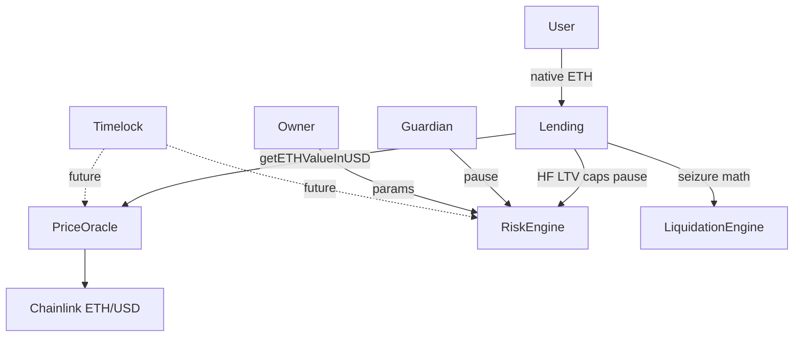

### 2.6 Current Risk Formulas

**Health Factor** (computed in `Lending._healthFactor` → `RiskEngine.healthFactor`):

```text
collateralAdjusted = (collateralUsd × liquidationThreshold) / 100
healthFactor       = (collateralAdjusted × 1e18) / debtUsd
```

**Borrow safety:** `debtUsd <= (collateralUsd × maxBorrowRatio) / 100` where defaults are `maxBorrowRatio = 50%`, `liquidationThreshold = 75%`.

**Liquidation eligibility:** `healthFactor < minHealthFactor` (default `1e18` = 1.0).

Because both `collateralUsd` and `debtUsd` derive from the **same ETH amounts** via the same oracle function, no cross-asset conversion is required today.

### 2.7 Known Ledger Gaps (Must Fix During Migration)

| Gap | Location | Impact |
| :--- | :--- | :--- |
| `liquidationEngine` not set in constructor | `Lending.sol` L77, L98–108 | `liquidate()` calls zero address unless wired externally |
| Liquidation does not decrement `totalSupply` | `Lending.liquidate()` | Global supply accounting diverges from sum of user deposits after liquidations |
| `getUSDToETH()` unused | `PriceOracle.sol` | Reserved for multi-asset; no consumer yet |
| No end-to-end liquidation tests | `test/unit/lending/` | Liquidation path untested at integration level |
| Global caps only | `RiskEngine.sol` | Cannot cap USDC borrow independently of ETH supply |

These gaps are **blockers for production** even in single-asset mode and must be resolved no later than Phase 7.

---

## 3. Why Single-Asset Architecture Cannot Scale

### 3.1 The Same-Unit Illusion

Today's protocol appears to perform cross-asset reasoning because it converts ETH to USD for risk checks. In reality, both sides of every comparison originate from the **same asset**:

```text
collateralUsd = oracle.getETHValueInUSD(user.deposited)   // ETH → USD
debtUsd       = oracle.getETHValueInUSD(user.borrowed)     // ETH → USD
```

USD is a **numeraire for ratio math**, not evidence of multi-asset support. The oracle never answers: *"What is 1 USDC worth?"* or *"How much WBTC equals $1,000 of seized value?"*

When collateral is ETH and debt is USDC:

- Deposit/withdraw must track **separate token balances** with different decimals.
- Borrow must draw from a **USDC liquidity pool**, not the ETH pool.
- Health factor must aggregate **heterogeneous collateral** with per-asset liquidation thresholds.
- Liquidation must convert **USDC repayment → WBTC/ETH seizure** via oracle prices.

None of these operations can be expressed in the current flat `User` struct.

### 3.2 Flat Storage Ceiling

`mapping(address => User)` provides one collateral slot and one debt slot per user. Extending it naïvely fails:

| Approach | Problem |
| :--- | :--- |
| Encode multiple assets in bit-packed `uint256` | Unmaintainable; breaks at scale; no per-asset interest |
| Parallel arrays inside `User` | Unbounded gas on iteration; dynamic length management |
| Separate contract per asset | Fragmented UX; no portfolio-level HF |
| **Nested mapping `user → asset → position`** | O(1) per-asset access; industry standard (Aave, Compound V3) |

The nested mapping pattern is the correct foundation. See [Section 4](#4-why-nested-mappings-are-preferred).

### 3.3 Global Accounting Blind Spots

Single `totalSupply` / `totalBorrow` / `totalLiquidity` values cannot support:

| Requirement | Why Global Totals Fail |
| :--- | :--- |
| Per-asset supply cap | Cannot limit USDC deposits while allowing unlimited ETH deposits |
| Per-asset borrow cap | Cannot cap USDC borrows independently |
| Utilization-based interest | Utilization = `totalBorrow / totalLiquidity` requires **per-reserve** numerator and denominator |
| Reserve factor / treasury accrual | Interest income must accrue per debt asset |
| Flash loan liquidity | Must verify `amount <= reserve.totalLiquidity` per asset |
| Insolvency isolation | Bad debt in one reserve should be traceable without polluting others |

Production money markets maintain **one reserve ledger per asset**. This blueprint introduces `mapping(address => ReserveData) reserves` in Phase 2.

### 3.4 Risk Homogeneity

Current defaults apply uniformly:

| Parameter | Default | Problem for Multi-Asset |
| :--- | :--- | :--- |
| `maxBorrowRatio` | 50% | Too high for volatile WBTC; may be too low for stable collateral in E-Mode |
| `liquidationThreshold` | 75% | Stablecoins need higher thresholds; volatile assets need lower |
| `supplyCap` / `borrowCap` | Global wei caps | Meaningless when assets have different decimals and prices |

Aave assigns **per-reserve** LTV, liquidation threshold, bonus, and caps. Phase 6 implements this pattern.

### 3.5 Liquidation Simplicity Breaks

Current seizure math (`LiquidationEngine.calculateSeizedCollateral`):

```text
seizedCollateral = repayAmount + (repayAmount × liquidationBonus / 100)
```

This adds bonus in **the same unit as repayment**. It is correct only when debt and collateral are both ETH.

Cross-asset example:

- User deposits 10 ETH ($20,000), borrows 8,000 USDC.
- ETH drops 40%. Position underwater.
- Liquidator repays 4,000 USDC (50% close factor).
- Liquidator must receive **ETH worth** $4,000 × 1.10 = $4,400 — not "4,000 + 10% USDC units of ETH."

Conversion requires:

```text
seizedEth = seizedValueUsd × 10^18 / (ethPriceUsd × normalizationFactor)
```

Phase 7 implements this. Phase 5 oracle integration is a hard prerequisite.

### 3.6 Operational and Security Consequences

| Failure Mode | Single-Asset Masking | Multi-Asset Exposure |
| :--- | :--- | :--- |
| Stale ETH price | All positions mispriced uniformly | Only ETH positions affected if per-asset feeds exist |
| Missing decimal normalization | Impossible (all 18-dec) | USDC 6-dec vs WBTC 8-dec → 10^10 magnitude errors |
| Same LTV for all assets | Acceptable for ETH-only | Over-borrow against volatile collateral |
| No asset registry | N/A | Arbitrary token addresses in mappings → unpriced assets |
| Liquidation in same unit | Works | Free collateral extraction or failed liquidations |

**Conclusion:** Multi-asset support is not an incremental feature — it is a **fundamental architectural refactor** of storage, accounting, risk, oracle, and liquidation layers. The eight-phase roadmap exists because these layers have distinct dependencies and must not be merged into a single risky release.

---

## 4. Why Nested Mappings Are Preferred

### 4.1 Target Storage Pattern

```text
// Per-user, per-asset position
struct UserAssetPosition {
    uint256 deposited;           // collateral balance (token-native decimals)
    uint256 borrowed;            // debt (token-native decimals)
    uint256 lastBorrowTimestamp; // per-debt-asset interest anchor
}

mapping(address user => mapping(address asset => UserAssetPosition)) userPositions;

// Per-asset protocol reserve
struct ReserveData {
    uint256 totalSupply;
    uint256 totalBorrow;
    uint256 totalLiquidity;
    uint256 borrowIndex;         // Phase 8: scaled debt index
    uint256 liquidityIndex;      // Phase 8: scaled supply index
}

mapping(address asset => ReserveData) reserves;
```

### 4.2 Comparison of Alternatives

| Pattern | Pros | Cons | Verdict |
| :--- | :--- | :--- | :--- |
| **Nested mapping** | O(1) read/write; predictable gas; Aave-aligned | No native enumeration | **Recommended** |
| Dynamic array per user | Enumerable | O(n) on HF calc; gas griefing via dust assets | Reject |
| Single packed bitmap | Compact | Limited asset count; no uint256 balances | Reject |
| ERC-6909 multi-token | Standardized | New token layer; migration complexity | Future optional wrapper |
| Separate pool contract per asset | Isolation | No cross-collateral portfolio; UX fragmentation | Reject for cross-collateral model |

### 4.3 Why O(1) Hot Paths Matter

Every `borrow`, `withdraw`, and `liquidate` must:

1. Accrue interest on affected debt assets.
2. Read collateral balances for HF calculation.
3. Update reserve totals.

With nested mappings, touching `(user, USDC)` debt does not require iterating `(user, ETH)`, `(user, WBTC)`, etc. **Portfolio-level HF** still requires iteration — but over the user's **active asset list**, not all registered assets. Phase 2 introduces `userCollateralAssets[]` and `userDebtAssets[]` enumeration helpers to bound iteration.

### 4.4 Enumeration Helpers

Nested mappings do not support `keys()`. Required companion storage:

```text
mapping(address user => address[]) internal userCollateralAssets;
mapping(address user => address[]) internal userDebtAssets;
mapping(address user => mapping(address asset => bool)) internal isInCollateralList;
mapping(address user => mapping(address asset => bool)) internal isInDebtList;
```

**Add-to-list rules:**

- On first non-zero deposit: push asset to `userCollateralAssets` if not already present.
- On deposit → zero AND no other collateral role: remove from list (swap-and-pop pattern).
- Mirror for debt on borrow/repay.

**Gas tradeoff:** Extra write on first touch; O(1) on subsequent operations. Acceptable for production.

### 4.5 Storage Slot Packing

`UserAssetPosition` fields are all `uint256` (balances exceed `uint128` at scale). No packing benefit for balances. Metadata flags (e.g., eMode category) should live in a separate compact mapping to avoid expanding the hot struct:

```text
mapping(address user => uint8) userEModeCategory;  // Phase 8
```

`AssetConfig` in the registry **can** be packed:

```text
struct AssetConfig {
    uint8 decimals;          // slot 1
    uint8 assetType;         // enum: None, Collateral, Borrowable, Both
    uint8 eModeCategory;
    bool enabled;
    bool isStablecoin;
    bool isolationModeEligible;
    // remaining bits unused — room for future flags
}
```

### 4.6 Native ETH Sentinel

Existing events use `address(0)` for ETH. Recommended sentinel:

```text
address constant ETH_SENTINEL = address(0);
```

Alternative: register WETH in AssetRegistry and treat all internal accounting as ERC-20. **Tradeoffs:**

| Approach | Pros | Cons |
| :--- | :--- | :--- |
| `address(0)` sentinel | Matches current events; native `msg.value` UX | Special-case logic throughout |
| WETH-only internal | Uniform ERC-20 code paths | Requires wrap on deposit; extra gas |

**Recommendation:** Phase 2–3 support `address(0)` sentinel with explicit branches; Phase 8 optionally unify to WETH internally while preserving `depositETH()` UX.

---

## 5. Cross-Cutting Concepts

These sections define shared vocabulary referenced by every phase. Read them before implementing any phase.

---

### 5.1 Asset Registry Design

The **Asset Registry** is the canonical on-chain catalog of tokens the protocol recognizes. It is the **gatekeeper** for every user-facing operation: if an asset is not registered and enabled, no deposit, borrow, or liquidation may touch it.

#### Purpose

| Consumer | Uses Registry For |
| :--- | :--- |
| `Lending.sol` | Validate asset on deposit/borrow/withdraw/repay/liquidate |
| `PriceOracle.sol` | Confirm asset exists before returning price (Phase 5) |
| `RiskEngine.sol` | Look up per-asset risk params keyed by asset address (Phase 6) |
| `LiquidationEngine.sol` | Read decimals for seizure conversion (Phase 7) |
| Indexers / frontends | Enumerate supported markets via `assetList[]` |

#### Core Struct (Conceptual)

```text
enum AssetType {
    None,
    CollateralOnly,
    BorrowableOnly,
    CollateralAndBorrowable
}

struct AssetConfig {
    uint8 decimals;              // from ERC-20 metadata or 18 for ETH
    AssetType assetType;
    bool enabled;                // false = frozen; existing positions may remain
    bool isStablecoin;
    uint8 eModeCategory;         // 0 = default; non-zero = E-Mode eligible (Phase 8)
    bool isolationModeEligible;  // Phase 8
}
```

#### Registry Storage

```text
mapping(address => AssetConfig) public assets;
mapping(address => bool) public isRegistered;
address[] public assetList;
uint256 public assetCount;
address public owner;
address public timelock;
```

#### Registration Lifecycle

```mermaid
flowchart LR
    Propose[Propose Asset] --> Queue[Timelock Queue]
    Queue --> Wait[Delay Period]
    Wait --> Validate[Validate Config]
    Validate --> Enable[Set enabled=true]
    Enable --> Live[User Operations Allowed]
    Live --> Disable[Guardian Disable]
    Disable --> WindDown[Wind-Down Period]
    WindDown --> Delist[Delist Asset]
```

**Rules:**

1. **Register** — add config with `enabled = false` initially.
2. **Enable** — requires oracle feed registered (Phase 5 gate) and risk params set (Phase 6 gate).
3. **Disable** — guardian or owner; blocks new deposits/borrows; existing positions remain.
4. **Delist** — only when `reserve.totalSupply == 0 && reserve.totalBorrow == 0`; irreversible.

#### Separate Contract vs Embedded Module

| Option | Recommendation |
| :--- | :--- |
| Standalone `AssetRegistry.sol` | **Preferred** — single source of truth; oracle and risk read without importing full Lending |
| Embedded in `Lending.sol` | Simpler deploy; creates circular dependency risk with other modules |

---

### 5.2 Multi-Asset Accounting

Multi-asset accounting splits into **two layers**:

#### Layer 1 — User Ledger (Micro)

```text
userPositions[user][asset].deposited   → collateral supplied by user in asset
userPositions[user][asset].borrowed    → debt owed by user in asset
userPositions[user][asset].lastBorrowTimestamp → interest anchor
```

A single user may have:

- `deposited > 0` for ETH and WBTC simultaneously.
- `borrowed > 0` for USDC only.
- Zero entries for assets never touched (empty mapping slots cost no storage).

#### Layer 2 — Reserve Ledger (Macro)

```text
reserves[asset].totalSupply    = Σ userPositions[*][asset].deposited
reserves[asset].totalBorrow    = Σ userPositions[*][asset].borrowed (incl. interest)
reserves[asset].totalLiquidity = ETH/tokens physically held − reserved
```

**Liquidity invariant (per asset):**

```text
reserves[asset].totalLiquidity <= IERC20(asset).balanceOf(lending)
```

For ETH sentinel: `reserves[ETH].totalLiquidity <= address(lending).balance`.

#### Interest Accrual Scope

Interest accrues **per (user, debtAsset)** pair:

```text
interest = (borrowed × ratePerSecond[debtAsset] × elapsed) / 1e18
userPositions[user][debtAsset].borrowed += interest
reserves[debtAsset].totalBorrow += interest
```

Collateral assets do not accrue interest in the basic model (supply yield is Phase 8 reserve index).

---

### 5.3 Cross-Asset Borrowing

Cross-asset borrowing allows a user to **deposit collateral in asset A** and **borrow asset B**.

#### Example Flow

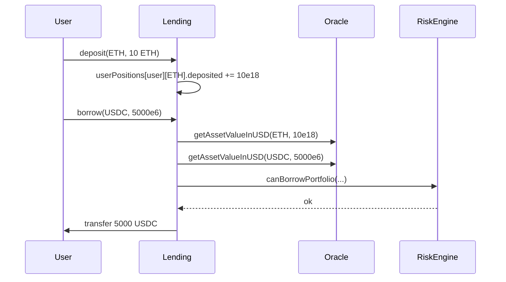

#### Solvency Rule

After borrow:

```text
totalDebtUsd <= totalMaxBorrowUsd

totalMaxBorrowUsd = Σ (collateralAmount_i × price_i × maxBorrowRatio_i / 100)
totalDebtUsd      = Σ (debtAmount_j × price_j)
```

Portfolio-level check replaces single-asset `canBorrow(collateralUsd, debtUsd)`.

#### Staged Rollout (Phase 4)

| Sub-Phase | Allowed | Blocked |
| :--- | :--- | :--- |
| **4a** | Multi-asset deposit; same-asset borrow only | Cross-asset borrow |
| **4b** | Full cross-asset borrow | Requires Phase 5 + 6 complete |

**Why staged:** Without per-asset oracle feeds and per-asset LTV, cross-asset borrow is unsafe.

---

### 5.4 Cross-Asset Liquidation

When a position is underwater, a liquidator **repays debt in the debt asset** and **receives collateral in a chosen collateral asset** (Aave-style).

#### Actors and Assets

| Role | Example |
| :--- | :--- |
| Collateral | ETH, WBTC, LINK |
| Debt | USDC, DAI |
| Liquidator pays | USDC |
| Liquidator receives | ETH (plus bonus) |

#### Seizure Formula

From [LIQUIDATION_ENGINE.md](./LIQUIDATION_ENGINE.md) Phase 4:

**Step 1 — Cap repayment:**

```text
maxRepay     = (debtAmount × closeFactor) / 100
repayAmount  = min(liquidatorRepay, maxRepay, userDebt)
```

**Step 2 — Compute seized value in USD:**

```text
repayUsd        = normalizeToUsd(debtAsset, repayAmount)
bonusUsd        = repayUsd × liquidationBonus / 100
seizedValueUsd  = repayUsd + bonusUsd
```

**Step 3 — Convert to collateral asset:**

```text
seizedCollateral = usdToAssetAmount(collateralAsset, seizedValueUsd)
```

**Combined (Chainlink 8-decimal feeds):**

```text
seizedCollateral = (repayAmount × debtPrice × (100 + bonus) × 10^collateralDecimals)
                   / (100 × collateralPrice × 10^debtDecimals × feedNormalization)
```

#### HF Improvement Requirement

Post-liquidation:

```text
healthFactor_after > healthFactor_before   (strict inequality)
```

Enforced in `Lending.liquidate()` today; retained in Phase 7.

#### Collateral Selection Strategy

**Recommended:** Liquidator specifies `collateralAsset` at call time (Aave V3 model). Protocol validates user holds sufficient balance of that collateral.

---

### 5.5 Oracle Conversions

Oracle integration is detailed in [PRICE_ORACLE.md](./PRICE_ORACLE.md) Phases 2–3. This section defines the **interface contract** between Lending and PriceOracle.

#### Required Functions (Phase 5 Target)

| Function | Purpose |
| :--- | :--- |
| `getPrice(address asset) → uint256` | USD price per 1 unit (normalized to 1e18) |
| `getAssetValueInUSD(address asset, uint256 amount) → uint256` | Convert token amount to 18-decimal USD |
| `getUsdToAssetAmount(address asset, uint256 usdAmount) → uint256` | Inverse conversion for seizure |
| `isPriceFresh(address asset) → bool` | Staleness check per asset |

#### Backward Compatibility

```text
getETHValueInUSD(ethAmount) → getAssetValueInUSD(ETH_SENTINEL, ethAmount)
getPrice()                  → getPrice(ETH_SENTINEL)
```

#### Fail-Closed Policy

If **any** asset in a user's portfolio has stale, paused, or missing price during a risk check → **revert entire transaction**. Partial valuation is unsafe.

---

### 5.6 Decimal Normalization

Token decimals vary. All USD values must normalize to **18-decimal USD** internally.

#### General Formula

```text
valueUsd = (amount × priceUsd × 10^18) / (10^tokenDecimals × 10^feedDecimals)
```

When `priceUsd` is pre-normalized to 18 decimals (recommended):

```text
valueUsd = (amount × priceUsd) / (10^tokenDecimals)
```

#### Worked Examples (ETH = $2,000, BTC = $60,000, USDC = $1.00)

| Asset | Amount | Decimals | Raw | USD Value |
| :--- | :--- | :--- | :--- | :--- |
| ETH | 1 ETH | 18 | 1e18 wei | $2,000 → 2000e18 |
| WBTC | 0.5 BTC | 8 | 5e7 sat | $30,000 → 30000e18 |
| USDC | 1,000 USDC | 6 | 1000e6 | $1,000 → 1000e18 |
| LINK | 500 LINK | 18 | 500e18 | depends on feed |

#### Rounding Policy

| Operation | Round Direction | Rationale |
| :--- | :--- | :--- |
| Collateral USD for HF | Down | Safer for protocol |
| Debt USD for HF | Up | Safer for protocol |
| Seized collateral | Down | Protocol retains dust |
| Repay amount applied | Down | Avoid over-deducting liquidator payment |

Document rounding per function in implementation PRs.

---

### 5.7 Risk Aggregation

Portfolio health requires **weighted aggregation** of heterogeneous collateral.

#### Collateral-Adjusted USD (HF Numerator)

```text
collateralUsdAdjusted = Σ_i ( amount_i × price_i × liquidationThreshold_i / 100 )
```

Each asset contributes proportionally to its **risk-adjusted** value, not raw market value.

#### Total Debt USD (HF Denominator)

```text
debtUsd = Σ_j ( debtAmount_j × price_j )
```

Includes accrued but not yet realized interest at check time.

#### Health Factor

```text
HF = (collateralUsdAdjusted × 1e18) / debtUsd
```

If `debtUsd == 0` → `HF = type(uint256).max`.

#### Max Borrow Capacity

```text
maxBorrowUsd = Σ_i ( amount_i × price_i × maxBorrowRatio_i / 100 )
```

Borrow allowed when:

```text
currentDebtUsd + newBorrowUsd <= maxBorrowUsd
```

#### Weighted Liquidation Threshold (Display / Analytics)

```text
weightedLT = Σ_i ( amount_i × price_i × LT_i ) / Σ_i ( amount_i × price_i )
```

Used by frontends; HF uses the summed adjusted form above.

---

### 5.8 Total Protocol Accounting

#### Per-Reserve Totals

| Field | Definition |
| :--- | :--- |
| `totalSupply` | Sum of all user collateral deposits in asset |
| `totalBorrow` | Sum of all user debt in asset |
| `totalLiquidity` | Tokens available for new borrows / withdrawals |
| `accruedToTreasury` | Protocol fee accumulator (Phase 8) |

#### Global Protocol Metrics (Off-Chain / View)

```text
protocolTvlUsd     = Σ_asset ( reserves[asset].totalSupply × price_asset )
protocolDebtUsd    = Σ_asset ( reserves[asset].totalBorrow × price_asset )
utilization[asset]   = totalBorrow / (totalLiquidity + totalBorrow)
```

#### Accounting Identity (Must Hold After Phase 3 Fix)

```text
Σ_users userPositions[u][asset].deposited == reserves[asset].totalSupply
```

Including after liquidations (seizure decrements both user deposit and `totalSupply`).

---

### 5.9 Asset Caps

Global caps in current `RiskEngine` (`supplyCap`, `borrowCap`) apply to ETH wei only. Multi-asset requires **per-reserve caps** in token-native units.

#### Per-Asset Cap Struct

```text
struct AssetRiskParams {
    uint256 supplyCap;   // max totalSupply for this asset (native decimals)
    uint256 borrowCap;   // max totalBorrow for this asset (native decimals)
    // ... LTV, threshold, etc.
}
```

#### Validation Points

| Action | Check |
| :--- | :--- |
| Deposit | `reserves[asset].totalSupply + amount <= supplyCap` |
| Borrow | `reserves[asset].totalBorrow + amount <= borrowCap` |

#### Cap Hierarchy

```text
borrowCap[asset] <= supplyCap[asset]   (cannot borrow more than could be supplied)
```

Governance sets caps via Timelock. Guardian may lower caps instantly; raising requires delay.

---

### 5.10 Reserve Accounting

Phase 8 introduces **index-based reserve accounting** (Aave-style). Conceptual preview:

#### Liquidity Index

Tracks cumulative supply yield:

```text
liquidityIndex_new = liquidityIndex_old × (1 + supplyRate × Δt)
userScaledSupply   = deposit / liquidityIndex
actualDeposit      = userScaledSupply × liquidityIndex
```

#### Borrow Index

Tracks cumulative debt growth:

```text
borrowIndex_new = borrowIndex_old × (1 + borrowRate × Δt)
userScaledDebt  = debt / borrowIndex
actualDebt      = userScaledDebt × borrowIndex
```

#### Reserve Factor

Fraction of borrow interest directed to protocol treasury:

```text
treasuryAccrual = interestAccrued × reserveFactor / 100
```

Phase 2 introduces `borrowIndex` placeholder in `ReserveData`; full index math is Phase 8.

---

### 5.11 Future: Isolation Mode

**Isolation Mode** restricts borrowing so a user with isolated collateral can only borrow **specific approved assets** up to a **debt ceiling**, without cross-collateralizing against the rest of their portfolio.

#### Design Hooks (Reserved in Phase 1)

```text
AssetConfig.isolationModeEligible = true
AssetRiskParams.debtCeiling         = uint256
mapping(address user => address)    userIsolationCollateral  // single isolated asset
```

#### Rules (Phase 8 Implementation)

1. User enables isolation mode with one collateral asset.
2. User may borrow only assets on the isolation borrow list.
3. Total isolated debt <= `debtCeiling` for that collateral.
4. Isolated collateral **cannot** back non-isolated borrows.
5. Non-isolated collateral **cannot** back isolated borrows.

#### Why Deferred

Isolation requires full portfolio aggregation (Phase 6) and per-asset risk params. Implementing before multi-asset accounting is complete adds complexity without testable value.

---

### 5.12 Future: E-Mode

**Efficiency Mode (E-Mode)** allows higher LTV and liquidation threshold when collateral and debt belong to the same **correlated category** (e.g., stablecoins, ETH LSTs).

#### Category Example

| Category ID | Assets | LTV | Liquidation Threshold |
| :--- | :--- | :--- | :--- |
| 0 (default) | All | per-asset default | per-asset default |
| 1 (Stablecoins) | USDC, DAI | 97% | 98% |
| 2 (ETH correlated) | ETH, stETH, wstETH | 93% | 95% |

#### User Opt-In

```text
userEModeCategory[user] = categoryId   // 0 = disabled
```

When active, risk checks use category LTV/threshold **instead of** per-asset defaults for assets in that category.

#### Constraints

- User may only enable E-Mode if **all** collateral and debt assets belong to the category.
- Changing E-Mode requires HF > 1.0 after transition.

---

### 5.13 Future: Stablecoins

Stablecoins require **additional risk controls** beyond volatile assets.

#### Registry Flag

```text
AssetConfig.isStablecoin = true
```

#### Additional Controls (Phase 8)

| Control | Purpose |
| :--- | :--- |
| Tighter staleness window | Detect depeg faster (e.g., 15 min vs 1 hour) |
| Peg band check | Revert if price < $0.95 or > $1.05 |
| Lower supply/borrow caps | Limit exposure to depeg events |
| Dedicated E-Mode category | High LTV among stables only |
| Circuit breaker hook | Auto-disable on oracle deviation (see PRICE_ORACLE.md Phase 5) |

#### Stablecoin as Debt Asset

Most common pattern: volatile collateral (ETH, WBTC) + stablecoin debt. Liquidation repays stablecoin; seizes volatile collateral — natural hedge for liquidators.

---

### 5.14 Future: Flash Loans

Flash loans allow **uncollateralized borrow** provided the loan is repaid (+ fee) in the **same transaction**.

#### Prerequisites

| Requirement | Phase |
| :--- | :--- |
| Accurate `reserves[asset].totalLiquidity` | Phase 2–3 |
| Reentrancy protection on all ERC-20 paths | Phase 3 |
| Per-asset liquidity invariant | Phase 3 |
| Flash loan fee parameter | Phase 8 |

#### Conceptual Interface

```text
function flashLoan(
    address asset,
    uint256 amount,
    address receiver,
    bytes calldata params
) external;
```

#### Flow

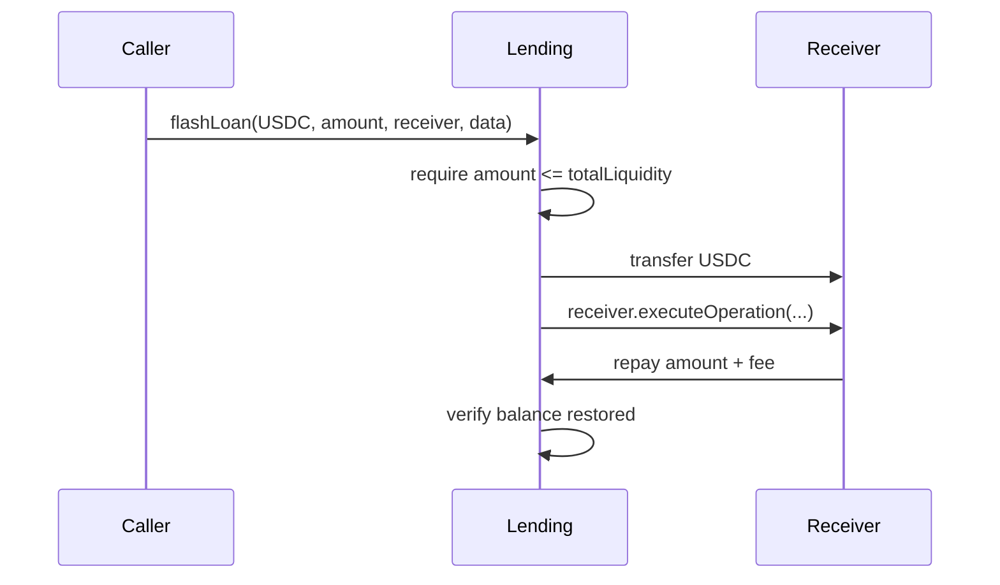

#### Security Notes

- Must not bypass health factor checks on **persistent** debt.
- Callback must complete before function returns.
- Fee accrues to `accruedToTreasury` or reserve liquidity.

---

## 6. Phase Dependency Overview

Phases must be implemented **in order**. Parallel work is possible only where the diagram shows no arrow.

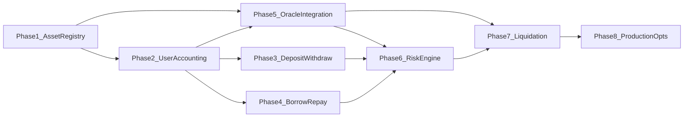

| Phase | Hard Depends On | Soft Depends On |
| :--- | :--- | :--- |
| 1 — Asset Registry | None | Timelock for governance |
| 2 — User Accounting | Phase 1 | — |
| 3 — Deposit/Withdraw | Phase 1, 2 | — |
| 4 — Borrow/Repay | Phase 1, 2, 3 | Phase 5 for cross-asset (4b) |
| 5 — Oracle Integration | Phase 1, 2 | — |
| 6 — Risk Engine | Phase 3, 4, 5 | — |
| 7 — Liquidation | Phase 5, 6 | Phase 3 accounting fix |
| 8 — Production Optimizations | Phase 7 | All prior phases |

### Uniform Phase Template

Every phase section (7–14) includes:

- Objective
- Why It Is Needed
- Architecture Changes
- Storage Changes (layout, mappings, structs)
- Required Events
- Required Modifiers
- New Validations
- New Edge Cases
- User Flow Changes
- Lending Flow
- Oracle Dependency
- RiskEngine Dependency
- Liquidation Dependency
- Future Extensibility
- Testing Strategy
- Fuzz Ideas
- Invariants

---

## 7. Phase 1 — Asset Registry

### Objective

Introduce the canonical on-chain catalog of supported assets **before** any multi-asset user state or token transfers exist. Phase 1 establishes the validated key set that all nested mappings, oracle feeds, and risk parameters will reference.

### Why It Is Needed

Every downstream module needs to answer: *"Is this token address a recognized protocol asset, and what are its properties?"*

Without a registry:

- `userPositions[user][randomToken]` could be written by a malicious frontend.
- Oracle could price unregistered tokens inconsistently.
- RiskEngine cannot assign per-asset LTV without a canonical asset list.
- Indexers cannot enumerate markets.

Phase 1 creates **governance-controlled asset listing** as the first gate in every user flow. It intentionally changes **no user-facing behavior** — only admin infrastructure and internal validation hooks.

### Architecture Changes

| Component | Change |
| :--- | :--- |
| **New contract** | `AssetRegistry.sol` (recommended standalone) |
| `Lending.sol` | Add `AssetRegistry public assetRegistry`; internal `_validateAsset(asset)` |
| `PriceOracle.sol` | No change yet; reads registry in Phase 5 |
| `RiskEngine.sol` | No change yet; reads registry in Phase 6 |
| `LiquidationEngine.sol` | No change yet; reads decimals via registry in Phase 7 |
| `Timelock.sol` | Becomes admin for `registerAsset`, `enableAsset`, `updateAsset` |

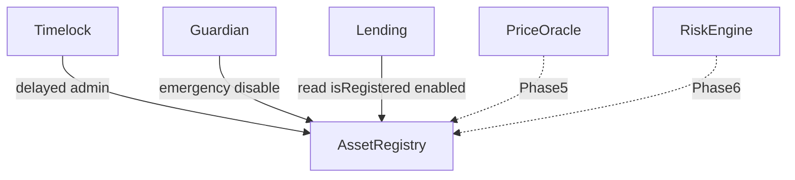

### Storage Changes

#### New Contract: AssetRegistry

**Structs:**

```text
enum AssetType {
    None,                   // 0 — invalid
    CollateralOnly,         // 1 — can deposit, cannot borrow
    BorrowableOnly,         // 2 — can borrow, cannot use as collateral (rare)
    CollateralAndBorrowable // 3 — full market asset
}

struct AssetConfig {
    uint8 decimals;
    AssetType assetType;
    bool enabled;
    bool isStablecoin;
    uint8 eModeCategory;           // 0 = none; reserved Phase 8
    bool isolationModeEligible;    // reserved Phase 8
}
```

**State variables:**

```text
mapping(address => AssetConfig) public assets;
mapping(address => bool) public isRegistered;
address[] public assetList;
uint256 public assetCount;
address public owner;
address public pendingOwner;
address public timelock;
address public guardian;
bool public registryPaused;
```

**Storage layout notes:**

- `AssetConfig` packs into a single slot (uint8 + enum + bools).
- `assetList` enables off-chain and on-chain enumeration.
- `assetCount` must always equal `assetList.length`.

#### Lending.sol (Minimal Phase 1 Touch)

```text
AssetRegistry public assetRegistry;   // set in constructor or setter via Timelock
```

No user storage changes in Phase 1.

### Required Mappings

| Mapping | Key | Value | Purpose |
| :--- | :--- | :--- | :--- |
| `assets` | `address asset` | `AssetConfig` | Full config |
| `isRegistered` | `address asset` | `bool` | O(1) existence check |
| `assetList` | index | `address` | Enumerable market list |

### Required Events

```text
event AssetRegistered(address indexed asset, AssetType assetType, uint8 decimals);
event AssetUpdated(address indexed asset, AssetType oldType, AssetType newType);
event AssetConfigUpdated(address indexed asset, string field, uint256 oldValue, uint256 newValue);
event AssetEnabled(address indexed asset);
event AssetDisabled(address indexed asset, address indexed by);
event AssetDelisted(address indexed asset);
event RegistryPaused(address indexed by);
event RegistryUnpaused(address indexed by);
event TimelockUpdated(address indexed oldTimelock, address indexed newTimelock);
event GuardianUpdated(address indexed oldGuardian, address indexed newGuardian);
```

### Required Modifiers

| Modifier | Condition | Used On |
| :--- | :--- | :--- |
| `onlyOwner` | `msg.sender == owner` | Pending ownership, timelock assignment |
| `onlyTimelock` | `msg.sender == timelock` | Register, enable, update, delist |
| `onlyGuardian` | `msg.sender == guardian` | Emergency disable, registry pause |
| `whenNotPaused` | `!registryPaused` | All state-changing registry ops |
| `assetMustExist(asset)` | `isRegistered[asset]` | Update, enable, disable |
| `assetMustBeEnabled(asset)` | `assets[asset].enabled` | Called by Lending in Phase 3+ |

### New Validations

| Rule | Revert Condition |
| :--- | :--- |
| Non-zero asset address | `asset == address(0)` allowed **only** if explicitly designated ETH sentinel |
| No duplicate registration | `isRegistered[asset] == true` on register |
| Valid decimals | `decimals >= 6 && decimals <= 18` |
| Valid asset type | `assetType != None` |
| Enable gate (Phase 5+) | Oracle feed must exist before `enabled = true` |
| Risk params gate (Phase 6+) | `RiskEngine.hasAssetParams(asset)` before enable |
| Delist gate | `totalSupply == 0 && totalBorrow == 0` in Lending reserve |
| ETH sentinel consistency | If `address(0)` registered, decimals must be 18 |

### New Edge Cases

| Edge Case | Handling |
| :--- | :--- |
| Re-enable disabled asset | Allowed via Timelock if oracle + risk gates pass |
| Disable asset with open positions | Allowed; blocks new deposits/borrows; existing positions remain |
| Delist with non-zero TVL | **Revert** — must wind down first |
| Register fake ERC-20 | Registry stores config; token transfers fail at Lending if not valid ERC-20 |
| Conflicting ETH vs WETH | Document policy: register one canonical ETH representation |
| `assetList` removal on delist | Swap-and-pop; decrement `assetCount` |
| Registry paused | All enable/disable blocked; Lending `_validateAsset` reverts on disabled assets |

### User Flow Changes

**None in Phase 1.** Users continue depositing/borrowing ETH only. Registry is admin-only infrastructure.

### Lending Flow

Internal hook added (not yet blocking user paths until Phase 3):

```text
function _validateAsset(address asset) internal view {
    if (!assetRegistry.isRegistered(asset)) revert Lending__AssetNotRegistered();
    if (!assetRegistry.assets(asset).enabled) revert Lending__AssetDisabled();
}
```

Existing `deposit()` payable path unchanged — optionally call `_validateAsset(ETH_SENTINEL)` for consistency.

### Oracle Dependency

| Dependency | Phase 1 Status |
| :--- | :--- |
| Registry stores `decimals` | Yes — copied from ERC-20 `decimals()` at registration |
| Oracle stores feed mapping | **No** — Phase 5 links feed to registered asset |
| Enable requires feed | Gate stubbed; enforced in Phase 5 |

### RiskEngine Dependency

| Dependency | Phase 1 Status |
| :--- | :--- |
| `assetType` for future LTV | Stored in registry |
| Per-asset risk params | **No** — Phase 6 |
| Enable requires risk params | Gate stubbed; enforced in Phase 6 |

### Liquidation Dependency

| Dependency | Phase 1 Status |
| :--- | :--- |
| Decimals for seizure math | Available via `assets[asset].decimals` |
| Cross-asset liquidation | **No** — Phase 7 |

### Future Extensibility

| Reserved Field | Future Use |
| :--- | :--- |
| `eModeCategory` | Phase 8 E-Mode category assignment |
| `isolationModeEligible` | Phase 8 Isolation Mode |
| `isStablecoin` | Phase 8 peg monitoring, tighter staleness |
| `AssetType.BorrowableOnly` | Stablecoin debt-only markets without collateral use |

### Testing Strategy

| Test File (Suggested) | Cases |
| :--- | :--- |
| `AssetRegistryRegister.t.sol` | Register valid asset; revert duplicate; revert invalid decimals |
| `AssetRegistryEnable.t.sol` | Enable/disable lifecycle; guardian emergency disable |
| `AssetRegistryDelist.t.sol` | Delist empty asset; revert delist with TVL |
| `AssetRegistryAccess.t.sol` | Only timelock registers; guardian cannot register |
| `AssetRegistryEnumeration.t.sol` | `assetList` length matches `assetCount` |

Integration: deploy registry + existing Lending; register ETH sentinel; verify no regression on ETH flows.

### Fuzz Ideas

| Target | Input Space |
| :--- | :--- |
| `registerAsset` | Random addresses, decimals 0–255, random AssetType |
| Enable/disable cycles | Random sequence of toggle operations |
| `assetList` integrity | Register N assets; delist subset; verify count |

### Invariants

```text
INV-P1-1: assetCount == assetList.length
INV-P1-2: isRegistered[a] == true ⟹ assets[a].decimals > 0
INV-P1-3: isRegistered[a] == false ⟹ assets[a] is zero/default
INV-P1-4: enabled ⟹ isRegistered
INV-P1-5: delisted asset ⟹ !isRegistered && !enabled
```

---

## 8. Phase 2 — Multi-Asset User Accounting

### Objective

Replace the flat `mapping(address => User)` with nested per-asset position storage and per-reserve global accounting, while preserving **byte-for-byte behavioral equivalence** for existing ETH-only users via migration shim.

### Why It Is Needed

Phase 1 defines *which* assets exist. Phase 2 defines *where* balances live. Without nested storage:

- A user cannot hold ETH collateral and USDC debt simultaneously.
- Interest cannot accrue independently per debt asset.
- Reserve-level totals cannot be tracked per asset.

Phase 2 is the **foundational storage migration**. Phases 3–4 add user-facing functions that read/write this layout. Implementing deposit/borrow refactors before Phase 2 forces a double migration — unacceptable production risk.

### Architecture Changes

| Component | Change |
| :--- | :--- |
| `Lending.sol` | Replace `User` / `users` with `UserAssetPosition` / `userPositions` + `reserves` |
| `Lending.sol` | Add enumeration helpers for portfolio iteration |
| `Lending.sol` | Migration: existing `users[user]` → `userPositions[user][ETH_SENTINEL]` |
| Global scalars | `totalLiquidity/Supply/Borrow` deprecated; read from `reserves[ETH]` during transition |
| External API | Unchanged user functions until Phase 3; internal reads redirected |

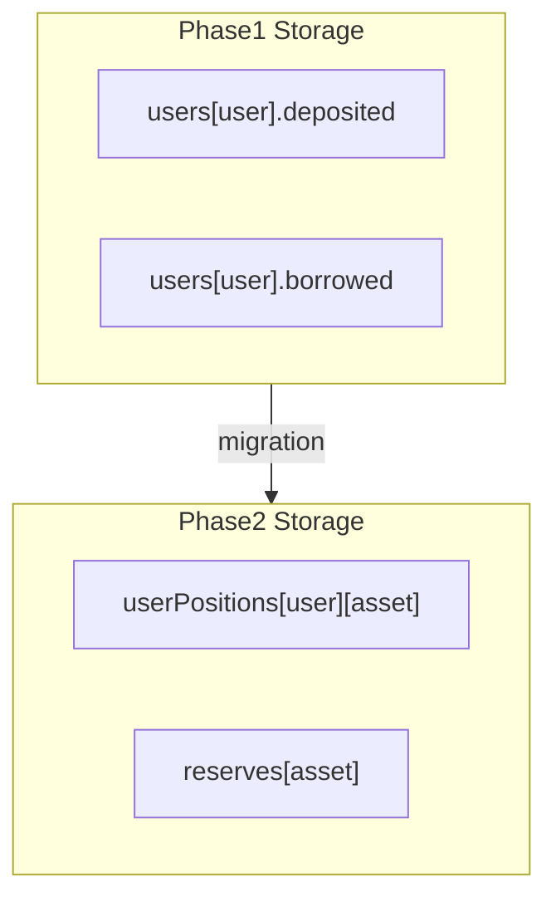

### Storage Changes

#### Replace User Struct

**Before:**

```text
struct User {
    uint256 deposited;
    uint256 borrowed;
    uint256 lastBorrowTimestamp;
}
mapping(address => User) public users;
```

**After:**

```text
struct UserAssetPosition {
    uint256 deposited;
    uint256 borrowed;
    uint256 lastBorrowTimestamp;
}

mapping(address => mapping(address => UserAssetPosition)) public userPositions;
```

#### New Reserve Struct

```text
struct ReserveData {
    uint256 totalSupply;
    uint256 totalBorrow;
    uint256 totalLiquidity;
    uint256 borrowIndex;      // initialized to 1e18; full use in Phase 8
    uint256 liquidityIndex;   // initialized to 1e18; full use in Phase 8
}

mapping(address => ReserveData) public reserves;
```

#### Enumeration Helpers

```text
mapping(address => address[]) internal _userCollateralAssets;
mapping(address => address[]) internal _userDebtAssets;
mapping(address => mapping(address => bool)) internal _isInCollateralList;
mapping(address => mapping(address => bool)) internal _isInDebtList;
```

#### Transition Compatibility Layer

During migration window, provide view shims:

```text
function getUserDeposit(address user) external view returns (uint256) {
    return userPositions[user][ETH_SENTINEL].deposited;
}
// Mirror for borrowed, lastBorrowTimestamp
```

Deprecate public `users` mapping getter — breaking change for external integrators; document in migration notes.

#### Global Scalar Deprecation

| Legacy Variable | Replacement |
| :--- | :--- |
| `totalLiquidity` | `reserves[ETH_SENTINEL].totalLiquidity` |
| `totalSupply` | `reserves[ETH_SENTINEL].totalSupply` |
| `totalBorrow` | `reserves[ETH_SENTINEL].totalBorrow` |

Keep legacy public getters as aliases during transition period; remove in Phase 8.

### Required Mappings

| Mapping | Purpose |
| :--- | :--- |
| `userPositions[user][asset]` | Per-user collateral and debt |
| `reserves[asset]` | Protocol-wide per-asset totals |
| `_userCollateralAssets[user]` | Active collateral asset list |
| `_userDebtAssets[user]` | Active debt asset list |
| `_isInCollateralList[user][asset]` | O(1) membership check |
| `_isInDebtList[user][asset]` | O(1) membership check |

### Required Events

```text
event ReserveInitialized(address indexed asset, uint256 borrowIndex, uint256 liquidityIndex);
event UserPositionUpdated(address indexed user, address indexed asset, uint256 deposited, uint256 borrowed);
event CollateralAssetAdded(address indexed user, address indexed asset);
event CollateralAssetRemoved(address indexed user, address indexed asset);
event DebtAssetAdded(address indexed user, address indexed asset);
event DebtAssetRemoved(address indexed user, address indexed asset);
event StorageMigrated(address indexed user, address indexed asset, uint256 deposited, uint256 borrowed);
```

### Required Modifiers

| Modifier | Purpose |
| :--- | :--- |
| `reserveInitialized(asset)` | `reserves[asset].borrowIndex != 0` |
| `validAsset(asset)` | `_validateAsset(asset)` from Phase 1 |

Internal helpers (not modifiers):

```text
_addCollateralAsset(user, asset)
_removeCollateralAssetIfZero(user, asset)
_addDebtAsset(user, asset)
_removeDebtAssetIfZero(user, asset)
_initReserveIfNeeded(asset)
```

### New Validations

| Rule | Detail |
| :--- | :--- |
| Reserve init on first touch | First operation on asset calls `_initReserveIfNeeded` |
| Index defaults | `borrowIndex = liquidityIndex = 1e18` (RAY) |
| Migration completeness | Every legacy `users[user]` entry copied to ETH sentinel |
| No double migration | Flag `migrationComplete[user]` or global `migrationDone` |
| List consistency | Asset in list ⟺ balance > 0 (after operation settles) |

### New Edge Cases

| Edge Case | Handling |
| :--- | :--- |
| First deposit in new asset | Init reserve + add to collateral list |
| Withdraw to zero | Remove from collateral list (swap-and-pop) |
| Repay to zero debt | Remove from debt list; reset `lastBorrowTimestamp` |
| Empty mapping slot | Default zero — no storage cost until first write |
| User with 10+ assets | Gas growth on HF iteration — document soft cap (Phase 8) |
| Migration user with zero balance | Skip write — no slot allocated |
| `borrowIndex` placeholder | Must not affect interest calc until Phase 8 |

### User Flow Changes

**Externally unchanged** if Phase 3 not yet deployed. Internally, `deposit()` reads/writes `userPositions[msg.sender][ETH_SENTINEL]` instead of `users[msg.sender]`.

Users should observe identical balances and HF after migration script runs.

### Lending Flow

#### Internal Read Path (All Functions)

```text
UserAssetPosition storage pos = userPositions[user][asset];
ReserveData storage reserve = reserves[asset];
```

#### Interest Accrual (Updated Signature)

```text
_accrueInterest(address user, address debtAsset) internal {
    UserAssetPosition storage pos = userPositions[user][debtAsset];
    if (pos.borrowed == 0) return;
    uint256 interest = _calculateInterest(pos.borrowed, pos.lastBorrowTimestamp, debtAsset);
    pos.borrowed += interest;
    reserves[debtAsset].totalBorrow += interest;
    pos.lastBorrowTimestamp = block.timestamp;
}
```

Per-asset interest rate: initially same constant as ETH; Phase 8 adds utilization model.

#### Migration Script (Conceptual)

```text
for each user with users[user].deposited > 0 OR users[user].borrowed > 0:
    userPositions[user][ETH_SENTINEL] = users[user]
    update reserves[ETH] totals
    populate collateral/debt lists
clear legacy users mapping (or mark deprecated)
```

### Oracle Dependency

| Item | Status |
| :--- | :--- |
| USD conversion | Still ETH-only via `getETHValueInUSD` |
| Portfolio iteration | Lists exist but HF still uses ETH sentinel only |
| Multi-asset prices | **Not required** until Phase 5 |

### RiskEngine Dependency

| Item | Status |
| :--- | :--- |
| Global caps | Still apply to ETH reserve totals via alias getters |
| Portfolio HF | **Not required** until Phase 6 |
| Per-asset pause | **Not required** until Phase 6 |

### Liquidation Dependency

| Item | Status |
| :--- | :--- |
| Seizure accounting | `totalSupply` fix prepared — decrement on seizure in Phase 7 |
| Cross-asset | **Not required** |

### Future Extensibility

| Hook | Purpose |
| :--- | :--- |
| `borrowIndex` / `liquidityIndex` in `ReserveData` | Phase 8 scaled balances |
| Asset list helpers | Phase 5 portfolio oracle valuation |
| `UserPositionUpdated` event | Indexer multi-asset tracking |

### Testing Strategy

| Suite | Cases |
| :--- | :--- |
| Migration tests | Legacy user → nested storage; totals preserved |
| Equivalence tests | All existing unit tests pass unchanged after internal redirect |
| Reserve init | First touch creates reserve with index = 1e18 |
| List management | Add/remove on zero balance transitions |
| Multi-slot isolation | User A ETH + User B USDC slots independent |
| Gas snapshots | Compare ETH deposit gas before/after (nested mapping overhead) |

### Fuzz Ideas

| Target | Property |
| :--- | :--- |
| Random (user, asset) writes | Totals match sum of positions |
| Deposit/withdraw cycles | List length bounded by distinct assets touched |
| Migration fuzz | Random legacy users → migrate → compare getters |

### Invariants

```text
INV-P2-1: reserves[a].totalSupply == Σ_u userPositions[u][a].deposited
INV-P2-2: reserves[a].totalBorrow == Σ_u userPositions[u][a].borrowed (after accrual)
INV-P2-3: _userCollateralAssets[u] contains only assets with deposited > 0
INV-P2-4: _userDebtAssets[u] contains only assets with borrowed > 0
INV-P2-5: reserves[ETH].totalLiquidity == address(lending).balance (ETH sentinel)
INV-P2-6: borrowIndex >= 1e18 (never decreases pre-Phase 8)
```

---

## 9. Phase 3 — Deposit / Withdraw Refactor

### Objective

Generalize collateral supply and withdrawal to support **any registered, enabled collateral asset** via ERC-20 transfers and native ETH, updating per-reserve accounting and preserving solvency checks (ETH-equivalent until Phase 5–6 enable full portfolio HF).

### Why It Is Needed

Phase 2 provides storage but no way for users to deposit WBTC or USDC. Phase 3 opens the **supply side** of the multi-asset market:

- Users diversify collateral (ETH + WBTC + LINK).
- Protocol accumulates per-reserve liquidity and supply totals.
- Supply caps become meaningful per asset.

Withdraw must re-validate solvency after removing collateral — initially using ETH-only oracle path for ETH collateral; non-ETH collateral deposits are allowed but **withdraw safety for multi-collateral portfolios** requires Phase 5–6.

### Architecture Changes

| Component | Change |
| :--- | :--- |
| `Lending.sol` | New `deposit(asset, amount)`, `depositETH()`, `withdraw(asset, amount)` |
| `Lending.sol` | Integrate `SafeERC20` for token transfers |
| `Lending.sol` | Per-reserve `totalSupply`, `totalLiquidity` updates |
| `Lending.sol` | Fix `totalSupply` decrement on all collateral-reducing paths |
| Events | `token` parameter populated with real asset addresses |

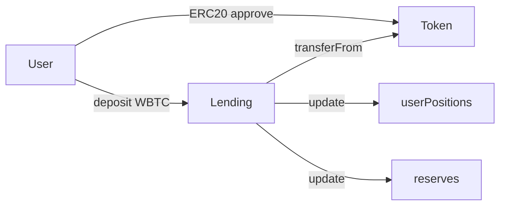

### Storage Changes

No new structs. Uses Phase 2 `userPositions` and `reserves`.

**New state (optional):**

```text
mapping(address => bool) public isCollateralAsset;   // cache from registry AssetType
```

Or read `assetRegistry.assets(asset).assetType` on each call.

### Required Mappings

Uses existing Phase 2 mappings. No additional mappings required.

### Required Events

Existing events unchanged in signature; new emission patterns:

```text
Deposited(user, WBTC, amount)
Withdrawn(user, USDC, amount)   // if USDC ever collateral
Deposited(user, address(0), amount)  // ETH sentinel
```

Optional admin events:

```text
event SupplyCapWarning(address indexed asset, uint256 utilizationBps);
```

### Required Modifiers

| Modifier | Purpose |
| :--- | :--- |
| `nonReentrant` | All deposit/withdraw paths (existing) |
| `moreThanZero(amount)` | Existing |
| `onlyCollateralAsset(asset)` | `assetType` is CollateralOnly or CollateralAndBorrowable |
| `whenDepositNotPaused(asset)` | Global + per-asset pause (Phase 6); global only in Phase 3 |

### New Validations

| Check | Detail |
| :--- | :--- |
| Asset registered + enabled | `_validateAsset(asset)` |
| Collateral capability | `assetType` allows collateral |
| Amount > 0 | Existing |
| Deposit pause | `riskEngine.depositPaused()` (+ per-asset Phase 6) |
| Supply cap | `totalSupply + amount <= supplyCap` (per-asset Phase 6; global stub Phase 3) |
| Sufficient deposit on withdraw | `pos.deposited >= amount` |
| Post-withdraw HF safe | `riskEngine.canWithdraw(...)` — portfolio version Phase 6 |
| ETH deposit | `msg.value == amount` when asset is ETH sentinel |
| ERC-20 deposit | `transferFrom` succeeds; no ETH sent |

### New Edge Cases

| Edge Case | Handling |
| :--- | :--- |
| Fee-on-transfer tokens | **Reject** at registry — not supported |
| Rebasing tokens | **Reject** at registry |
| Duplicate deposit same block | Allowed; cumulative balance |
| Withdraw entire balance | Remove from collateral list |
| Deposit while HF < 1 | Allowed — deposit improves HF |
| Withdraw would break HF | Revert `Lending__BreakHealthFactor` |
| ETH sentinel + msg.value mismatch | Revert |
| ERC-20 with no return value | Use SafeERC20 |
| Reentrancy on ERC-20 hook | `nonReentrant` on all paths |
| First deposit to new reserve | `_initReserveIfNeeded` |

### User Flow Changes

#### Deposit ERC-20 Collateral

1. User approves `Lending` for `amount`.
2. User calls `deposit(WBTC, amount)`.
3. Protocol pulls tokens, credits `userPositions[user][WBTC].deposited`.
4. Updates `reserves[WBTC].totalSupply`, `totalLiquidity`.
5. Emits `Deposited(user, WBTC, amount)`.

#### Deposit Native ETH

1. User calls `depositETH{value: amount}()` or `deposit(ETH_SENTINEL, amount){value: amount}`.
2. Protocol credits ETH sentinel position.
3. Updates ETH reserve totals.

#### Withdraw Collateral

1. User calls `withdraw(asset, amount)`.
2. Protocol accrues interest on all user debt assets.
3. Computes post-withdraw portfolio HF (Phase 6) or ETH-only HF (interim).
4. Debits deposit; decrements `reserves[asset].totalSupply` and `totalLiquidity`.
5. Transfers tokens or ETH to user.

### Lending Flow

#### Deposit (Pseudocode)

```text
deposit(asset, amount):
    _validateAsset(asset)
    require collateral-capable assetType
    require !depositPaused
    _initReserveIfNeeded(asset)
    if asset == ETH_SENTINEL:
        require msg.value == amount
    else:
        safeTransferFrom(asset, msg.sender, address(this), amount)
    userPositions[sender][asset].deposited += amount
    reserves[asset].totalSupply += amount
    reserves[asset].totalLiquidity += amount
    _addCollateralAsset(sender, asset)
    _checkSupplyCap(asset)          // Phase 6 per-asset
    emit Deposited(sender, asset, amount)
```

#### Withdraw (Pseudocode)

```text
withdraw(asset, amount):
    _validateAsset(asset)
    accrue all debt assets for sender
    require userPositions[sender][asset].deposited >= amount
    _validateWithdrawSafety(sender, asset, amount)   // HF check
    userPositions[sender][asset].deposited -= amount
    reserves[asset].totalSupply -= amount            // FIX: always decrement
    reserves[asset].totalLiquidity -= amount
    _removeCollateralAssetIfZero(sender, asset)
    transfer asset to sender
    emit Withdrawn(sender, asset, amount)
```

### Oracle Dependency

| Operation | Oracle Need |
| :--- | :--- |
| Deposit | None |
| Withdraw (ETH-only portfolio) | `getETHValueInUSD` for HF |
| Withdraw (multi-collateral) | **Phase 5** — price each collateral asset |
| Withdraw (multi-collateral HF) | **Phase 6** — portfolio aggregation |

**Interim policy (Phase 3):** Allow non-ETH deposits; restrict withdraw HF check to ETH collateral only OR block second collateral type until Phase 5. **Recommended:** allow deposits of multiple assets but require Phase 5 before enabling withdraw on non-ETH without full HF.

### RiskEngine Dependency

| Function | Phase 3 | Phase 6 |
| :--- | :--- | :--- |
| `depositPaused()` | Global | + per-asset |
| `canSupply(total, amount)` | Global cap on ETH reserve alias | Per-asset `canSupply(asset, ...)` |
| `canWithdraw(collateralUsd, debtUsd)` | ETH USD values | Portfolio USD values |

### Liquidation Dependency

Phase 3 fixes `totalSupply` decrement pattern that Phase 7 liquidation must use:

```text
reserves[collateralAsset].totalSupply -= seizedAmount
```

### Future Extensibility

| Hook | Phase |
| :--- | :--- |
| Supply index credit on deposit | Phase 8 |
| Isolation mode deposit restriction | Phase 8 |
| aToken mint on deposit | Optional future receipt token |

### Testing Strategy

| Suite | Cases |
| :--- | :--- |
| `DepositERC20.t.sol` | WBTC/USDC mock deposit; balance updates |
| `DepositETH.t.sol` | Backward compat `depositETH` |
| `Withdraw.t.sol` | Partial/full withdraw; HF revert |
| `DepositWithdrawIntegration.t.sol` | Multi-asset deposit sequence |
| Reentrancy | Malicious ERC-20 callback |
| `totalSupply` sync | After withdraw matches sum of users |
| Supply cap | Revert when cap exceeded (stub/global) |

### Fuzz Ideas

| Target | Property |
| :--- | :--- |
| deposit → withdraw random amounts | User balance ≥ 0; reserve totals consistent |
| Random ERC-20 decimals (6, 8, 18) | Accounting in native decimals |
| Multi-user same asset | Sum of deposits == totalSupply |

### Invariants

```text
INV-P3-1: After deposit/withdraw, INV-P2-1..P2-5 hold
INV-P3-2: reserves[a].totalLiquidity <= token.balanceOf(lending) for ERC-20
INV-P3-3: withdraw never reduces HF below safe threshold
INV-P3-4: deposit never decreases totalSupply
INV-P3-5: totalSupply decrements on every collateral-reducing path (incl. future liquidation)
```

---

## 10. Phase 4 — Borrow / Repay Refactor

### Objective

Enable borrowing and repayment of **any registered borrowable asset** against user collateral, with per-reserve liquidity tracking, per-asset interest accrual, and staged cross-asset borrow rollout.

### Why It Is Needed

Phase 3 completes the **supply side**. Phase 4 completes the **borrow side** of the money market:

- Users borrow USDC against ETH/WBTC collateral (after Phase 5–6).
- Protocol tracks per-reserve debt and liquidity.
- Interest accrues per debt asset independently.

Without Phase 4, deposited collateral is idle from a lending perspective — no stablecoin debt, no utilization, no interest income model.

### Architecture Changes

| Component | Change |
| :--- | :--- |
| `Lending.sol` | `borrow(asset, amount)`, `repay(asset, amount)`, `repayETH()` |
| `Lending.sol` | Per-asset interest rate table (fixed initially) |
| `Lending.sol` | `_accrueInterest(user, debtAsset)` on all debt-touching paths |
| `RiskEngine` | Per-asset borrow cap stub; full portfolio in Phase 6 |
| Staged rollout | **4a:** same-asset borrow; **4b:** cross-asset after Phase 5+6 |

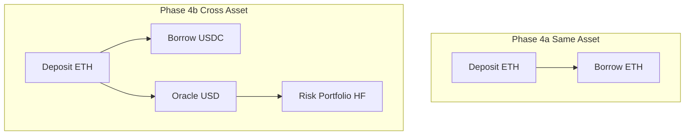

### Storage Changes

#### Per-Asset Interest Rates

```text
mapping(address => uint256) public borrowRatePerSecond;   // default 5% APR equivalent
mapping(address => uint256) public supplyRatePerSecond;   // Phase 8
```

#### Feature Flags

```text
bool public crossAssetBorrowEnabled;   // false until Phase 6 complete
```

Uses Phase 2 `userPositions`, `reserves`, debt asset lists.

### Required Mappings

| Mapping | Purpose |
| :--- | :--- |
| `borrowRatePerSecond[asset]` | Per-debt-asset interest |
| `crossAssetBorrowEnabled` | Staged rollout gate |

### Required Events

```text
Borrowed(user, asset, amount)          // existing signature
Repaid(user, asset, amount)            // existing signature
InterestAccrued(user, debtAsset, amount)
BorrowRateUpdated(asset, oldRate, newRate)
CrossAssetBorrowEnabled(bool enabled)
```

### Required Modifiers

| Modifier | Purpose |
| :--- | :--- |
| `onlyBorrowableAsset(asset)` | AssetType allows borrow |
| `whenBorrowNotPaused(asset)` | Pause check |
| `moreThanZero(amount)` | Existing |

### New Validations

| Check | Detail |
| :--- | :--- |
| Borrowable asset type | `BorrowableOnly` or `CollateralAndBorrowable` |
| Borrow pause | Global + per-asset (Phase 6) |
| Liquidity | `amount <= reserves[asset].totalLiquidity` |
| Borrow cap | Per-asset (Phase 6) |
| Cross-asset gate | If `borrowAsset != collateralAsset(s)`, require `crossAssetBorrowEnabled` |
| Portfolio solvency | Phase 6 `canBorrowPortfolio`; Phase 4a uses same-asset USD check |
| Repay cap | `repayAmount = min(requested, userDebt)` |
| Repay refund | Excess ETH/tokens returned to sender |
| First borrow | Set `lastBorrowTimestamp = block.timestamp` |
| Full repay | Reset timestamp to 0; remove from debt list |

### New Edge Cases

| Edge Case | Handling |
| :--- | :--- |
| Borrow without collateral | Revert — debtUsd > maxBorrowUsd |
| Borrow max uint256 | Revert on liquidity / cap |
| Repay more than debt | Cap; refund excess |
| Repay on zero debt | Revert `Lending__NotAnyBorrow` |
| Interest between accrual calls | Included in `getTotalDebt(user, asset)` view |
| Same-block borrow + repay | Allowed; accrue first |
| Borrow stablecoin with only ETH collateral (4a) | **Blocked** until crossAssetBorrowEnabled |
| Multiple debt assets | Accrue all before any borrow/repay |
| Flash loan callback borrow | Blocked by reentrancy guard |

### User Flow Changes

#### Borrow

1. User has collateral deposited (Phase 3).
2. User calls `borrow(USDC, 5000e6)`.
3. Protocol accrues existing debt across all debt assets.
4. Validates portfolio solvency (Phase 6) or same-asset (Phase 4a).
5. Checks USDC liquidity and borrow cap.
6. Increments `userPositions[user][USDC].borrowed`.
7. Decrements `reserves[USDC].totalLiquidity`; increments `totalBorrow`.
8. Transfers USDC to user.

#### Repay

1. User approves USDC or sends ETH for WETH debt.
2. User calls `repay(USDC, amount)`.
3. Protocol accrues interest on USDC debt.
4. Caps repay at outstanding debt.
5. Reduces debt; increases reserve liquidity.
6. Refunds excess.

### Lending Flow

#### Borrow (Pseudocode)

```text
borrow(asset, amount):
    _validateAsset(asset)
    require borrowable assetType
    require !borrowPaused
    _accrueAllUserDebts(sender)
    if !crossAssetBorrowEnabled:
        require _hasSameAssetCollateral(sender, asset)   // Phase 4a
    else:
        require riskEngine.canBorrowPortfolio(...)       // Phase 4b / Phase 6
    require amount <= reserves[asset].totalLiquidity
    _checkBorrowCap(asset, amount)
    userPositions[sender][asset].borrowed += amount
    if first borrow: lastBorrowTimestamp = now
    reserves[asset].totalBorrow += amount
    reserves[asset].totalLiquidity -= amount
    _addDebtAsset(sender, asset)
    safeTransfer(asset, sender, amount)
    emit Borrowed(sender, asset, amount)
```

#### Repay (Pseudocode)

```text
repay(asset, amount):
    _validateAsset(asset)
    _accrueInterest(sender, asset)
    debt = userPositions[sender][asset].borrowed
    require debt > 0
    repayAmount = min(amount, debt)
    pull tokens from sender (or msg.value for ETH debt)
    userPositions[sender][asset].borrowed -= repayAmount
    if borrowed == 0: reset timestamp; _removeDebtAssetIfZero
    reserves[asset].totalBorrow -= repayAmount
    reserves[asset].totalLiquidity += repayAmount
    refund excess
    emit Repaid(sender, asset, repayAmount)
```

### Oracle Dependency

| Mode | Requirement |
| :--- | :--- |
| Phase 4a (same-asset) | Existing `getETHValueInUSD` when asset is ETH sentinel |
| Phase 4b (cross-asset) | **Phase 5** — `getAssetValueInUSD` for every collateral and debt asset |
| Repay | None |

### RiskEngine Dependency

| Function | Phase 4 | Phase 6 |
| :--- | :--- | :--- |
| `canBorrow` | Same-asset USD | `canBorrowPortfolio` |
| `canGlobalBorrow` | Global cap alias | `canBorrow(asset, total, amount)` |
| `borrowPaused()` | Global | + per-asset |

### Liquidation Dependency

Accurate `userPositions[user][debtAsset].borrowed` and `reserves[debtAsset].totalBorrow` required for Phase 7 debt repayment during liquidation.

### Future Extensibility

| Hook | Phase |
| :--- | :--- |
| Variable interest rate model | Phase 8 |
| Stablecoin-specific borrow caps | Phase 8 |
| Credit delegation | Future |
| Isolation mode borrow restriction | Phase 8 |

### Testing Strategy

| Suite | Cases |
| :--- | :--- |
| `BorrowSameAsset.t.sol` | ETH deposit → ETH borrow (4a) |
| `BorrowCrossAsset.t.sol` | ETH deposit → USDC borrow (4b; enable flag) |
| `Repay.t.sol` | Partial, full, overpay refund |
| `BorrowLiquidity.t.sol` | Revert when liquidity insufficient |
| `BorrowCap.t.sol` | Per-asset cap enforcement |
| `MultiDebt.t.sol` | User borrows USDC + DAI; independent accrual |
| Interest | Per-asset rate; accrual updates totalBorrow |

### Fuzz Ideas

| Target | Property |
| :--- | :--- |
| borrow → repay cycles | Debt returns to zero; liquidity restored |
| Random borrow amounts | Never exceeds liquidity or cap |
| Multi-debt accrual | totalBorrow >= sum of principals |

### Invariants

```text
INV-P4-1: reserves[a].totalBorrow == Σ_u userPositions[u][a].borrowed (post-accrual)
INV-P4-2: borrow never increases reserves[a].totalLiquidity
INV-P4-3: repay never decreases totalLiquidity below 0
INV-P4-4: sum of borrows across users <= reserves.totalLiquidity + totalBorrow (utilization)
INV-P4-5: crossAssetBorrowEnabled == false ⟹ borrow asset must equal collateral asset
INV-P4-6: getTotalDebt(user, asset) >= userPositions[user][asset].borrowed
```

---

## 11. Phase 5 — Oracle Integration

### Objective

Connect the Asset Registry to a multi-asset `PriceOracle`, replacing all ETH-specific pricing with per-asset USD conversion and portfolio-level valuation helpers. Enable cross-asset solvency checks required for Phase 4b, Phase 6, and Phase 7.

### Why It Is Needed

Phases 1–4 can store multi-asset balances, but **risk math without accurate per-asset prices is unsafe**. A user depositing worthless scam tokens as "collateral" would pass HF checks if those tokens are valued at zero or not priced at all.

Phase 5 is the **economic security boundary** for multi-asset mode. It implements the oracle side of the blueprint described in [PRICE_ORACLE.md](./PRICE_ORACLE.md) Phases 2–3. This document focuses on **Lending integration**; feed registration, staleness, and aggregation details remain in the oracle blueprint.

### Architecture Changes

| Component | Change |
| :--- | :--- |
| `PriceOracle.sol` | `mapping(address => AggregatorV3Interface) feeds` |
| `PriceOracle.sol` | `mapping(address => uint256) assetStaleTime` |
| `PriceOracle.sol` | `mapping(address => bool) assetEnabled` |
| `PriceOracle.sol` | `getPrice(asset)`, `getAssetValueInUSD(asset, amount)` |
| `PriceOracle.sol` | Portfolio helpers: `getPortfolioCollateralUsd`, `getPortfolioDebtUsd` |
| `Lending.sol` | Replace all `getETHValueInUSD` with `getAssetValueInUSD` |
| `AssetRegistry` | Enable gate: asset cannot be enabled without registered feed |
| `Timelock` | Feed registration and replacement |

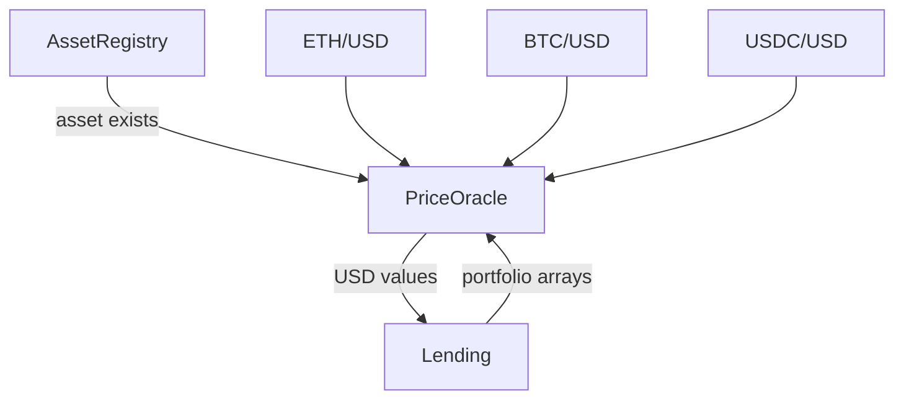

### Storage Changes

#### PriceOracle Additions

```text
struct AssetFeedConfig {
    AggregatorV3Interface feed;
    uint256 staleTime;       // default 1 hours; tighter for stables Phase 8
    bool enabled;
    uint8 feedDecimals;      // cached at registration
}

mapping(address => AssetFeedConfig) public assetFeeds;
mapping(address => bool) public feedRegistered;

uint256 public constant USD_PRECISION = 1e18;
uint256 public constant FEED_PRECISION = 1e8;   // legacy; per-feed in config
```

#### Lending Additions

```text
// Optional: cache oracle for tx-level portfolio calc (Phase 8 gas opt)
// No mandatory new storage in Phase 5
```

### Required Mappings

| Contract | Mapping | Purpose |
| :--- | :--- | :--- |
| PriceOracle | `assetFeeds[asset]` | Feed + staleness + enabled |
| PriceOracle | `feedRegistered[asset]` | Existence check |
| AssetRegistry | (existing) | `decimals` for normalization |

### Required Events

```text
// PriceOracle
event AssetFeedRegistered(address indexed asset, address indexed feed, uint256 staleTime);
event AssetFeedUpdated(address indexed asset, address indexed oldFeed, address indexed newFeed);
event AssetFeedDisabled(address indexed asset);
event AssetPriceStale(address indexed asset, uint256 updatedAt, uint256 staleTime);
event OraclePaused(address indexed by);
event OracleUnpaused(address indexed by);

// Lending (integration)
event PortfolioValued(address indexed user, uint256 collateralUsd, uint256 debtUsd);
```

### Required Modifiers

| Contract | Modifier | Purpose |
| :--- | :--- | :--- |
| PriceOracle | `onlyOwner` / `onlyTimelock` | Feed admin |
| PriceOracle | `whenNotPaused` | Global pause |
| PriceOracle | `assetFeedExists(asset)` | Price queries |
| PriceOracle | `assetFeedFresh(asset)` | Staleness enforced on read |

### New Validations

| Rule | Detail |
| :--- | :--- |
| Feed registration | Asset must be in AssetRegistry |
| Test read on register | `latestRoundData()` returns price > 0 |
| Staleness | `block.timestamp - updatedAt <= staleTime` |
| Disabled feed | Revert all price queries |
| Global pause | Revert all price queries |
| Portfolio valuation | Revert if **any** asset in set fails price check |
| Backward compat | `getETHValueInUSD(x)` → `getAssetValueInUSD(ETH_SENTINEL, x)` |
| Overflow | Validate `amount * price` per token decimals |

### New Edge Cases

| Edge Case | Handling |
| :--- | :--- |
| Partial portfolio price failure | Revert entire valuation (fail-closed) |
| Feed updated mid-block | Consistent within single tx |
| Asset disabled with open positions | Existing positions cannot transact (price revert) |
| WBTC uses BTC/USD feed | Document scaling if shared feed |
| USDC depeg to $0.90 | Phase 8 peg band; Phase 5 uses raw feed |
| Zero amount conversion | Return 0 without oracle call |
| Very large amounts | Overflow check before multiply |
| ETH sentinel pricing | Same feed as Phase 1 ETH/USD |

### User Flow Changes

Users observe:

- Cross-asset borrow enabled once oracle + risk portfolio checks live.
- Transactions revert during oracle pause or stale feed — clear error messages.
- HF reflects all collateral/debt assets at current prices.

No new user-facing functions — existing flows gain accurate pricing.

### Lending Flow

#### Portfolio Valuation (Internal)

```text
_getUserCollateralUsd(user):
    assets = _userCollateralAssets[user]
    amounts[i] = userPositions[user][assets[i]].deposited
    return oracle.getPortfolioCollateralUsd(assets, amounts)

_getUserDebtUsd(user):
    assets = _userDebtAssets[user]
    amounts[i] = getTotalDebt(user, assets[i])
    return oracle.getPortfolioDebtUsd(assets, amounts)

_healthFactor(user):
    collateralUsd = _getUserCollateralUsd(user)   // raw for display
    debtUsd = _getUserDebtUsd(user)
    adjustedCollateral = riskEngine.applyLiquidationThresholds(user, ...)  // Phase 6
    return riskEngine.healthFactor(adjustedCollateral, debtUsd)
```

#### Integration Points

| Lending Function | Oracle Calls |
| :--- | :--- |
| `borrow` | All collateral USD + all debt USD + new borrow USD |
| `withdraw` | Remaining collateral USD + debt USD |
| `liquidate` | Full portfolio USD before/after (Phase 7) |
| `getHealthFactor` | Full portfolio |

### Oracle Dependency

Phase 5 **is** the oracle phase. Internal dependencies:

- AssetRegistry for asset existence and decimals
- Chainlink aggregators per asset
- Timelock for feed admin

Cross-reference [PRICE_ORACLE.md](./PRICE_ORACLE.md) for:

- Phase 4 aggregation (median of multiple feeds)
- Phase 5 circuit breakers
- Phase 6 institutional staleness

### RiskEngine Dependency

RiskEngine still receives **USD values** — not raw oracle calls. Phase 5 enables Lending to compute accurate USD inputs. Phase 6 adds per-asset LT/LTV weighting on those values.

### Liquidation Dependency

Phase 7 requires:

- `getAssetValueInUSD(debtAsset, repayAmount)`
- `getUsdToAssetAmount(collateralAsset, seizedValueUsd)`

Both must be available at end of Phase 5.

### Future Extensibility

| Feature | Document |
| :--- | :--- |
| Multi-oracle median | PRICE_ORACLE.md Phase 4 |
| Circuit breakers | PRICE_ORACLE.md Phase 5 |
| TWAP / fallback hierarchy | PRICE_ORACLE.md Phase 6 |
| Peg-specific stablecoin logic | Phase 8 + PRICE_ORACLE |

### Testing Strategy

| Suite | Cases |
| :--- | :--- |
| Per-asset feed registration | Valid/invalid feeds |
| Staleness revert | Advance time past staleTime |
| Decimal normalization | USDC 6, WBTC 8, ETH 18 |
| Portfolio valuation | Multi-asset sum matches manual calc |
| Fail-closed | One stale asset reverts portfolio |
| Backward compat | `getETHValueInUSD` matches Phase 1 behavior |
| Fork tests | Real Chainlink feeds on testnet |

### Fuzz Ideas

| Target | Property |
| :--- | :--- |
| Random amounts × assets | Conversion monotonic in amount |
| Portfolio with N assets | Sum linearity |
| Price bounds | No overflow for max uint256/2 amounts |

### Invariants

```text
INV-P5-1: getAssetValueInUSD(a, 0) == 0
INV-P5-2: getAssetValueInUSD(a, x) monotonic in x (fixed price)
INV-P5-3: enabled asset in registry ⟹ feedRegistered OR revert on enable
INV-P5-4: paused oracle ⟹ all Lending risk ops revert
INV-P5-5: portfolioUsd == Σ individual asset USD values
```

---

## 12. Phase 6 — Risk Engine Refactor

### Objective

Replace global risk parameters with **per-asset risk configuration** and **portfolio-level validation functions** that aggregate heterogeneous collateral and debt using Phase 5 USD valuations.

### Why It Is Needed

Global `maxBorrowRatio = 50%` and `liquidationThreshold = 75%` are unsafe when assets have different volatility profiles. WBTC requires lower LTV; stablecoin collateral may allow higher LTV in E-Mode (Phase 8).

Phase 6 is the **policy brain** for multi-asset solvency. Without it, Phase 4b cross-asset borrow and Phase 7 liquidation operate on incorrect risk boundaries.

### Architecture Changes

| Component | Change |
| :--- | :--- |
| `RiskEngine.sol` | `mapping(address => AssetRiskParams) assetRisk` |
| `RiskEngine.sol` | Portfolio functions: `canBorrowPortfolio`, `canWithdrawPortfolio` |
| `RiskEngine.sol` | Weighted HF: `computeAdjustedCollateralUsd` |
| `RiskEngine.sol` | Per-asset pause flags |
| `RiskEngine.sol` | Per-asset supply/borrow caps (replace global) |
| `Lending.sol` | Call portfolio risk functions on borrow/withdraw |
| `Lending.sol` | Enable `crossAssetBorrowEnabled = true` after tests pass |

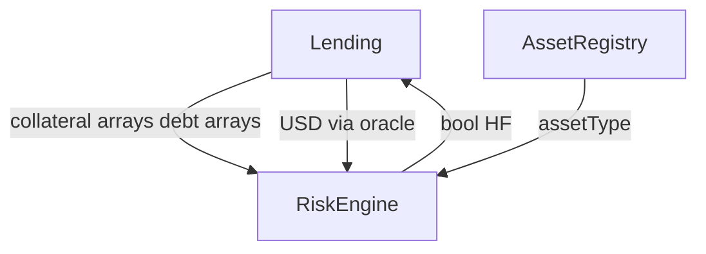

### Storage Changes

#### AssetRiskParams Struct

```text
struct AssetRiskParams {
    uint256 maxBorrowRatio;        // LTV % (1-100)
    uint256 liquidationThreshold;  // HF weight % (1-100)
    uint256 supplyCap;             // native token units
    uint256 borrowCap;             // native token units
    bool depositPaused;
    bool borrowPaused;
    bool liquidatePaused;
}

mapping(address => AssetRiskParams) public assetRisk;
mapping(address => bool) public hasAssetParams;
```

#### Global Params (Retained)

```text
uint256 public minHealthFactor;     // still global (default 1e18)
address public guardian;            // global emergency
bool public globalPause;          // optional master pause
```

**Removed / deprecated:**

- Global `supplyCap`, `borrowCap` as primary enforcement — aliased to ETH reserve during migration only
- `closeFactor`, `liquidationBonus` remain in LiquidationEngine (not RiskEngine)

### Required Mappings

| Mapping | Purpose |
| :--- | :--- |
| `assetRisk[asset]` | Full per-asset params |
| `hasAssetParams[asset]` | Gate for asset enable in registry |

### Required Events

```text
event AssetRiskParamsSet(address indexed asset, uint256 ltv, uint256 threshold, uint256 supplyCap, uint256 borrowCap);
event AssetRiskParamUpdated(address indexed asset, string param, uint256 oldVal, uint256 newVal);
event AssetBorrowPaused(address indexed asset);
event AssetBorrowUnpaused(address indexed asset);
event AssetDepositPaused(address indexed asset);
event AssetDepositUnpaused(address indexed asset);
event PortfolioBorrowValidated(address indexed user, uint256 maxBorrowUsd, uint256 newDebtUsd);
event CrossAssetBorrowPolicyUpdated(bool enabled);
```

### Required Modifiers

| Modifier | Purpose |
| :--- | :--- |
| `onlyOwner` / `onlyTimelock` | Param updates |
| `onlyGuardian` | Per-asset pause |
| `assetParamsExist(asset)` | Operations referencing asset |

### New Validations

| Rule | Detail |
| :--- | :--- |
| LTV < liquidationThreshold | Per asset, same as global rule today |
| minHealthFactor >= 1e18 | Global |
| borrowCap <= supplyCap | Per asset |
| Param bounds | LTV, threshold in [1, 100] |
| Portfolio borrow | `newTotalDebtUsd <= maxBorrowUsd` |
| Portfolio withdraw | Post-withdraw HF safe via adjusted collateral |
| Enable asset in registry | Requires `hasAssetParams[asset]` |
| Ratio consistency | Higher volatility → lower LTV (governance policy, not enforced in code) |

#### Portfolio Borrow Validation

```text
maxBorrowUsd = Σ_i ( collateralAmount_i × price_i × maxBorrowRatio_i / 100 )
totalDebtUsd = Σ_j ( debtAmount_j × price_j ) + newBorrowUsd
require totalDebtUsd <= maxBorrowUsd
```

#### Portfolio HF

```text
adjustedCollateralUsd = Σ_i ( collateralAmount_i × price_i × liquidationThreshold_i / 100 )
HF = (adjustedCollateralUsd × 1e18) / totalDebtUsd
```

### New Edge Cases

| Edge Case | Handling |
| :--- | :--- |
| User with 5 collateral types | Sum all; gas proportional to list length |
| Zero debt | HF = max uint |
| Single asset portfolio | Equivalent to Phase 1 math |
| Withdraw last collateral with debt | Revert |
| Borrow at exact LTV boundary | Revert on > ; allow == (document policy) |
| Paused borrow on one asset | Other debt assets unaffected |
| Governance lowers LTV | Existing positions grandfathered until interaction |
| Isolation mode (future) | Override portfolio aggregation rules |

### User Flow Changes

- Cross-asset borrow **enabled** after Phase 6 deployment + testing.
- Users can deposit ETH + WBTC, borrow USDC up to portfolio LTV.
- Withdraw blocked if multi-asset HF would break.
- Per-asset pauses visible in UI (asset grayed out).

### Lending Flow

```text
borrow(asset, amount):
    (collAssets, collAmts) = _userCollateralSnapshot(sender)
    (debtAssets, debtAmts) = _userDebtSnapshot(sender)
    require riskEngine.canBorrowPortfolio(
        collAssets, collAmts, collPrices,
        debtAssets, debtAmts, debtPrices,
        asset, amount, newBorrowPrice
    )
    ...

withdraw(asset, amount):
    require riskEngine.canWithdrawPortfolio(
        sender snapshot with reduced collateral
    )
    ...
```

### Oracle Dependency

| Requirement | Detail |
| :--- | :--- |
| USD inputs | Lending passes pre-computed USD arrays OR raw amounts + oracle |
| Price freshness | RiskEngine assumes fresh prices; Lending must revert before call if stale |
| No direct oracle calls in RiskEngine | Preserve separation of concerns |

### RiskEngine Dependency

Phase 6 **is** the RiskEngine phase. Becomes authoritative source for:

- Per-asset LTV/threshold/caps
- Portfolio solvency
- Per-asset pause

### Liquidation Dependency

| Export | Used By |
| :--- | :--- |
| `isLiquidatable(HF)` | LiquidationEngine / Lending |
| `computeAdjustedCollateralUsd` | HF before/after liquidation |
| Per-asset `liquidatePaused` | Block liquidation of specific collateral |

### Future Extensibility

| Feature | Hook |
| :--- | :--- |
| E-Mode | Override LTV/threshold when `userEModeCategory > 0` |
| Isolation Mode | Separate `canBorrowIsolated` path |
| Dynamic LTV based on utilization | Phase 8 interest model coupling |
| Risk admin role | Separate from owner |

### Testing Strategy

| Suite | Cases |
| :--- | :--- |
| Per-asset param set/update | Bounds, timelock |
| Portfolio borrow | ETH collateral + USDC borrow at LTV limit |
| Portfolio withdraw | Revert when HF would break |
| Multi-collateral HF | Weighted threshold manual verification |
| Per-asset pause | Deposit/borrow blocked per asset |
| Cap enforcement | Per-asset supply/borrow caps |
| Regression | Single-asset ETH behaves identically |

### Fuzz Ideas

| Target | Property |
| :--- | :--- |
| Random portfolio composition | borrow never exceeds maxBorrowUsd |
| Withdraw random amounts | HF never below 1.0 after successful withdraw |
| Param changes | LTV always < threshold |

### Invariants

```text
INV-P6-1: ∀ asset: assetRisk[a].maxBorrowRatio < assetRisk[a].liquidationThreshold
INV-P6-2: ∀ asset: assetRisk[a].borrowCap <= assetRisk[a].supplyCap
INV-P6-3: successful borrow ⟹ totalDebtUsd <= maxBorrowUsd
INV-P6-4: successful withdraw ⟹ HF >= minHealthFactor (or no debt)
INV-P6-5: hasAssetParams[a] required for registry enable
```

---

## 13. Phase 7 — Liquidation Refactor

### Objective

Implement **cross-asset liquidation** with liquidator-specified debt repayment and collateral seizure, wire `LiquidationEngine` into `Lending` constructor, fix reserve accounting on seizure, and enable keeper-ready `previewLiquidation`.

### Why It Is Needed

Multi-asset positions become underwater when collateral prices drop or debt accrues. Without cross-asset liquidation:

- USDC debt cannot be closed by seizing ETH collateral.
- Bad debt accumulates; protocol insolvency follows.

Phase 7 is the **corrective control** layer. It depends on accurate pricing (Phase 5) and portfolio HF (Phase 6). It implements the liquidation side of [LIQUIDATION_ENGINE.md](./LIQUIDATION_ENGINE.md) Phase 4.

### Architecture Changes

| Component | Change |
| :--- | :--- |
| `Lending.sol` | Wire `liquidationEngine` in constructor |
| `Lending.sol` | `liquidate(user, debtAsset, repayAmount, collateralAsset)` |
| `Lending.sol` | Fix `totalSupply` decrement on seizure |
| `LiquidationEngine.sol` | Cross-asset `calculateSeizedCollateral(debtAsset, collateralAsset, repayAmount, prices...)` |
| `LiquidationEngine.sol` | Extend `previewLiquidation` for multi-asset |
| `Lending.sol` | Pull debt asset from liquidator (ERC-20) or ETH |

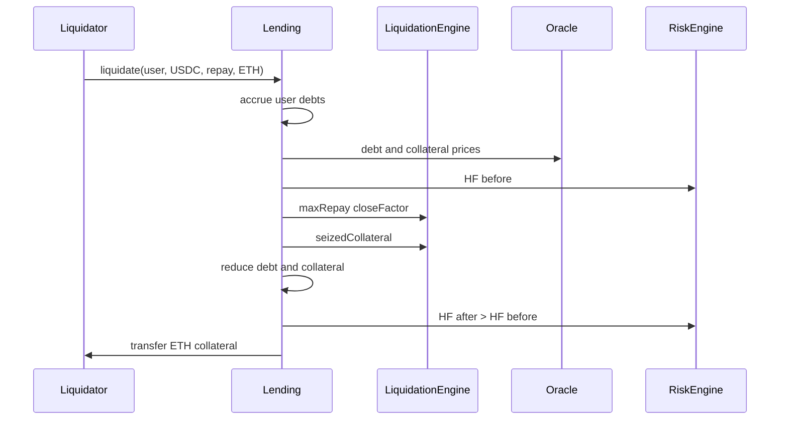

### Storage Changes

#### Lending Constructor Fix

```text
constructor(address _oracle, address _riskEngine, address _liquidationEngine) {
    ...
    liquidationEngine = LiquidationEngine(_liquidationEngine);
}
```

#### LiquidationEngine Additions

```text
struct MultiAssetLiquidationParams {
    address debtAsset;
    address collateralAsset;
    uint256 repayAmount;
    uint256 debtPriceUsd;
    uint256 collateralPriceUsd;
    uint8 debtDecimals;
    uint8 collateralDecimals;
}
```

No new persistent storage required in Lending beyond constructor wiring.

### Required Mappings

None new. Uses existing positions, reserves, asset configs for decimals.

### Required Events

```text
event Liquidated(
    address indexed liquidator,
    address indexed user,
    address indexed debtAsset,
    address collateralAsset,
    uint256 debtRepaid,
    uint256 collateralSeized
);
event LiquidationPreviewed(address indexed user, bool canExecute, uint256 hfBefore, uint256 hfAfter);
```

Update existing `Liquidated` event to include asset addresses (breaking change for indexers — document).

### Required Modifiers

| Modifier | Purpose |
| :--- | :--- |
| `whenLiquidationNotPaused` | Global + per-asset |
| `moreThanZero(repayAmount)` | Valid liquidation |
| `nonReentrant` | Critical on token transfers |

### New Validations

| Check | Detail |
| :--- | :--- |
| HF before | `isLiquidatable(HF_before)` |
| HF after | `HF_after > HF_before` (strict) |
| Close factor | `repay <= closeFactor × userDebt` |
| Seizure cap | `seized <= user collateral balance` |
| Debt reduction | `userDebt -= repay`; `reserve.totalBorrow -= repay` |
| Collateral reduction | `userDeposited -= seized`; `reserve.totalSupply -= seized` |
| Liquidity | Debt repay increases `reserve[debtAsset].totalLiquidity` |
| Liquidator payment | Pull exact repay amount; refund excess |
| Self-liquidation | Allowed but must still improve HF; no profitable self-dealing via oracle manipulation |
| Zero seize after rounding | Revert if repay > 0 but seized == 0 |

### New Edge Cases

| Edge Case | Handling |
| :--- | :--- |
| Seizure > single collateral balance | Cap at balance; may need second liquidation |
| Multiple collateral types | Liquidator chooses asset (Aave model) |
| Dust liquidation | Min repay threshold (governance param) |
| Partial close factor | Remaining debt still liquidatable |
| Liquidate while oracle stale | Revert fail-closed |
| ETH debt repayment | `msg.value` path |
| USDC debt + WBTC collateral | Full decimal normalization |
| totalSupply fix | Always decrement on seizure |
| Liquidator specifies wrong collateral | Revert insufficient balance |

### User Flow Changes

#### Liquidator Flow

1. Identify underwater user (HF < 1).
2. Call `previewLiquidation(user, USDC, repayAmount, ETH)` off-chain.
3. Approve USDC to Lending.
4. Call `liquidate(user, USDC, repayAmount, ETH)`.
5. Receive ETH collateral including bonus.

#### Borrower Experience

- Position partially liquidated; debt and collateral reduced.
- HF improves but may remain < 1 until further liquidations.
- Other collateral assets untouched unless liquidator targets them in subsequent txs.

### Lending Flow

```text
liquidate(user, debtAsset, repayAmount, collateralAsset):
    require !liquidationPaused
    _accrueAllUserDebts(user)
    hfBefore = _healthFactor(user)
    require riskEngine.isLiquidatable(hfBefore)
    currentDebt = getTotalDebt(user, debtAsset)
    maxRepay = liquidationEngine.calculateMaxLiquidation(currentDebt)
    effectiveRepay = min(repayAmount, maxRepay, currentDebt)
    require effectiveRepay > 0
    pull debtAsset from liquidator (effectiveRepay)
    debtPrice = oracle.getPrice(debtAsset)
    collPrice = oracle.getPrice(collateralAsset)
    seized = liquidationEngine.calculateSeizedCollateralMulti(
        debtAsset, collateralAsset, effectiveRepay, debtPrice, collPrice
    )
    seized = min(seized, userPositions[user][collateralAsset].deposited)
    userPositions[user][debtAsset].borrowed -= effectiveRepay
    userPositions[user][collateralAsset].deposited -= seized
    reserves[debtAsset].totalBorrow -= effectiveRepay
    reserves[debtAsset].totalLiquidity += effectiveRepay
    reserves[collateralAsset].totalSupply -= seized
    _removeCollateralAssetIfZero(user, collateralAsset)
    hfAfter = _healthFactor(user)
    require hfAfter > hfBefore
    transfer collateralAsset to liquidator
    emit Liquidated(...)
```

### Oracle Dependency

| Call | Purpose |
| :--- | :--- |
| `getPrice(debtAsset)` | Repay USD value |
| `getPrice(collateralAsset)` | Seizure amount |
| Full portfolio HF | Before/after validation |

Critical: use **same block prices** for before/after HF to prevent manipulation within tx (standard practice).

### RiskEngine Dependency

| Function | Purpose |
| :--- | :--- |
| `isLiquidatable(HF)` | Gate |
| Weighted collateral for HF | Before/after comparison |
| `liquidatePaused` per asset | Emergency |

### Liquidation Dependency

Phase 7 **is** the liquidation integration phase. Delivers:

- Constructor wiring fix
- Cross-asset seizure math
- `previewLiquidation` multi-asset
- Accounting fix for `totalSupply`

Cross-reference [LIQUIDATION_ENGINE.md](./LIQUIDATION_ENGINE.md) for Phase 5 dynamic close factor (Phase 8).

### Future Extensibility

| Feature | Phase |
| :--- | :--- |
| Dynamic close factor by HF | Phase 8 |
| Batch liquidation | LIQUIDATION_ENGINE Phase 6 |
| Dutch auction liquidation | Future |
| Auto-liquidation bots | Off-chain + `previewLiquidation` |

### Testing Strategy

| Suite | Cases |
| :--- | :--- |
| Same-asset liquidation | ETH/ETH regression |
| Cross-asset | USDC repay, ETH seize |
| HF improvement | Revert if HF_after <= HF_before |
| Close factor | Max 50% debt per tx |
| Seizure cap | Cannot seize more than deposited |
| totalSupply | Decrements match seizure |
| previewLiquidation | Matches execution |
| Integration | Full deposit → borrow → price drop → liquidate |
| Reentrancy | Malicious liquidator contract |

### Fuzz Ideas

| Target | Property |
| :--- | :--- |
| Random repay amounts | HF strictly increases |
| Random collateral choice | Seized <= balance |
| Decimal combinations | USDC/DAI/WBTC/ETH matrix |

### Invariants

```text
INV-P7-1: successful liquidation ⟹ HF_after > HF_before
INV-P7-2: debtRepaid <= closeFactor × debtBefore
INV-P7-3: collateralSeized <= user collateral before
INV-P7-4: reserves[collateral].totalSupply decrements by seized
INV-P7-5: reserves[debt].totalBorrow decrements by repaid
INV-P7-6: liquidator debt balance decreases by repaid (net of refund)
```

---

## 14. Phase 8 — Production Optimizations

### Objective

Transform the multi-asset MVP into a **production-grade money market** with index-based interest accrual, utilization-based rate models, reserve factors, gas optimizations, Isolation Mode v1, E-Mode v1, stablecoin hardening, and flash loan support.

### Why It Is Needed

Phases 1–7 deliver functional multi-asset lending with fixed rates and lazy interest. Production deployment at scale requires:

- **Fair interest** — utilization-based rates balance supply and demand.
- **Gas efficiency** — portfolio iteration must not exceed block gas limits.
- **Advanced risk modes** — Isolation and E-Mode match user expectations from Aave/Compound.
- **Protocol revenue** — reserve factor funds treasury and insurance.
- **Capital efficiency** — flash loans for arbitrage and liquidations.

Phase 8 is **not optional for mainnet at TVL** — it is the production hardening layer.

### Architecture Changes

| Component | Change |
| :--- | :--- |
| `Lending.sol` | Scaled balance index accounting |
| `Lending.sol` | `flashLoan(asset, amount, receiver, params)` |
| `RiskEngine.sol` | E-Mode category params; isolation debt ceilings |
| `PriceOracle.sol` | Stablecoin peg bands; tighter staleness (see PRICE_ORACLE.md) |
| `LiquidationEngine.sol` | Dynamic close factor / bonus curves |
| `Timelock` | All param and rate model updates |

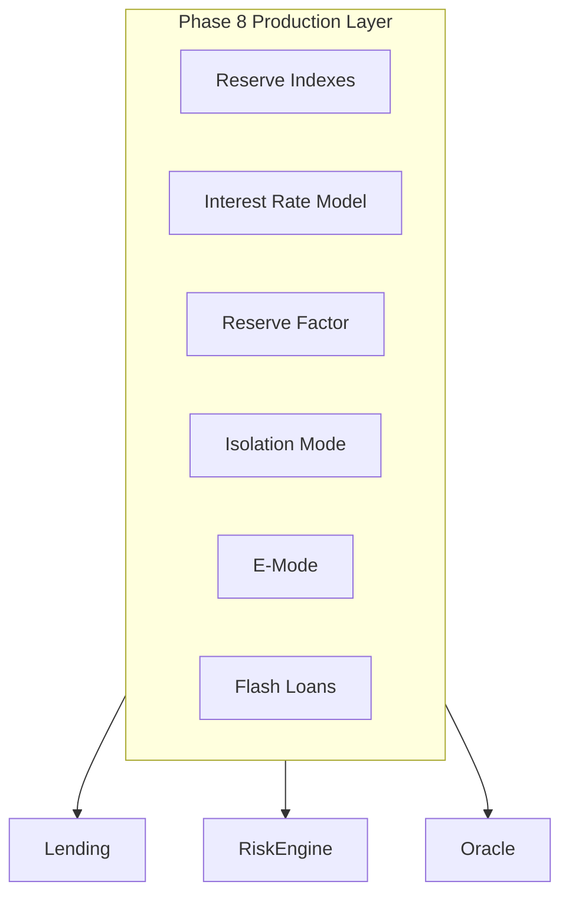

### Storage Changes

#### ReserveData (Extended)

```text
struct ReserveData {
    uint256 totalSupply;           // scaled supply × liquidityIndex
    uint256 totalBorrow;           // scaled borrow × borrowIndex
    uint256 totalLiquidity;
    uint256 liquidityIndex;        // RAY 1e27
    uint256 borrowIndex;           // RAY 1e27
    uint256 accruedToTreasury;
    uint256 reserveFactor;         // bps to treasury
    uint128 currentLiquidityRate;
    uint128 currentBorrowRate;
    uint40 lastUpdateTimestamp;
}
```

#### UserAssetPosition (Extended)

```text
struct UserAssetPosition {
    uint256 scaledDeposited;       // deposit / liquidityIndex
    uint256 scaledBorrowed;        // debt / borrowIndex
    uint256 lastBorrowTimestamp;   // deprecated if index-only
}
```

Or maintain raw balances with index applied at touch — document chosen approach in implementation.

#### E-Mode Storage

```text
struct EModeCategory {
    uint8 id;
    uint256 ltv;
    uint256 liquidationThreshold;
    uint256 liquidationBonus;
    address[] allowedAssets;
}
mapping(uint8 => EModeCategory) public eModeCategories;
mapping(address => uint8) public userEModeCategory;
```

#### Isolation Storage

```text
mapping(address => uint256) public isolationDebtCeiling;
mapping(address user => address) public userIsolationModeAsset;
```

#### Flash Loan

```text
mapping(address => uint256) public flashLoanFeeBps;   // per asset
```

### Required Mappings

All listed above plus:

```text
mapping(address => InterestRateModel) public rateModel;
mapping(address => uint256) public maxUserAssets;     // soft cap gas griefing
```

### Required Events

```text
event ReserveIndexUpdated(address indexed asset, uint256 liquidityIndex, uint256 borrowIndex);
event InterestRatesUpdated(address indexed asset, uint256 borrowRate, uint256 supplyRate);
event TreasuryAccrued(address indexed asset, uint256 amount);
event EModeCategoryConfigured(uint8 indexed categoryId, uint256 ltv, uint256 threshold);
event UserEModeSet(address indexed user, uint8 categoryId);
event IsolationModeEntered(address indexed user, address indexed collateralAsset);
event IsolationDebtCeilingUpdated(address indexed asset, uint256 ceiling);
event FlashLoan(address indexed initiator, address indexed asset, uint256 amount, uint256 fee);
event FlashLoanFeeUpdated(address indexed asset, uint256 feeBps);
```

### Required Modifiers

| Modifier | Purpose |
| :--- | :--- |
| `onlyRateAdmin` | Interest model updates |
| `validEModeCategory(id)` | E-Mode ops |
| `flashLoanActive(asset)` | Feature flag per asset |

### New Validations

| Rule | Detail |
| :--- | :--- |
| Index monotonicity | `liquidityIndex`, `borrowIndex` never decrease |
| Utilization | `U = totalBorrow / (totalLiquidity + totalBorrow)` |
| Rate model bounds | Borrow rate capped at governance max |
| Reserve factor | `<= 10000 bps` |
| E-Mode enable | All user assets in category |
| Isolation borrow | Debt asset on isolation list; ceiling not exceeded |
| Flash loan | Repaid + fee in same tx; liquidity restored |
| Stablecoin peg | Oracle price within band or revert |
| maxUserAssets | Revert new asset touch if over cap |

### New Edge Cases

| Edge Case | Handling |
| :--- | :--- |
| Index overflow | Use RAY 1e27; periodic design review |
| Zero utilization | Minimum borrow rate floor |
| 100% utilization | Supply rate spikes; borrow rate spikes |
| Flash loan reentrancy | `nonReentrant` + checks-effects-interactions |
| E-Mode downgrade with HF < 1 | Revert |
| Isolation exit | Requires zero isolated debt |
| Treasury withdrawal | Separate governance function |
| WETH unification | Optional internal accounting migration |

### User Flow Changes

| Feature | User Experience |
| :--- | :--- |
| Variable rates | APY displayed per asset; changes with utilization |
| E-Mode | Opt-in higher LTV for correlated assets |
| Isolation Mode | Borrow stablecoins against single volatile collateral with ceiling |
| Flash loans | Developer/arbitrageur single-tx uncollateralized borrow |
| Supply yield | Depositors earn interest via liquidity index |

### Lending Flow

#### Index Update (On Touch)

```text
_updateReserveIndexes(asset):
    elapsed = block.timestamp - reserve.lastUpdateTimestamp
    U = utilization(asset)
    (borrowRate, supplyRate) = rateModel.getRates(U, reserveFactor)
    reserve.borrowIndex *= compound(borrowRate, elapsed)
    reserve.liquidityIndex *= compound(supplyRate, elapsed)
    reserve.lastUpdateTimestamp = block.timestamp
```

#### Flash Loan

```text
flashLoan(asset, amount, receiver, params):
    _updateReserveIndexes(asset)
    require amount <= reserves[asset].totalLiquidity
    fee = amount × flashLoanFeeBps / 10000
    transfer asset to receiver
    receiver.executeOperation(asset, amount, fee, params)
    require balanceAfter >= balanceBefore + fee
    reserves[asset].totalLiquidity += fee
    emit FlashLoan(...)
```

### Oracle Dependency

| Feature | Oracle Need |
| :--- | :--- |
| Stablecoin peg band | `getPrice(USDC)` within [$0.95, $1.05] |
| E-Mode | Prices for category assets |
| Flash liquidation | Same-block prices |

See [PRICE_ORACLE.md](./PRICE_ORACLE.md) Phase 5–6 for circuit breakers and TWAP.

### RiskEngine Dependency

| Feature | RiskEngine Role |
| :--- | :--- |
| E-Mode | Category LTV/threshold override |
| Isolation | `canBorrowIsolated(user, asset, amount)` |
| Dynamic LTV | Optional utilization coupling |

### Liquidation Dependency

| Feature | LiquidationEngine Role |
| :--- | :--- |
| Dynamic close factor | Higher HF → lower close factor (optional) |
| Dynamic bonus | Higher HF → lower bonus |
| Flash loan liquidations | Liquidator uses flash loan to repay debt |

See [LIQUIDATION_ENGINE.md](./LIQUIDATION_ENGINE.md) Phase 5.

### Future Extensibility

| Feature | Beyond Phase 8 |
| :--- | :--- |
| Governance token | stkLAND voting on params |
| Insurance fund | Bad debt socialization |
| Cross-chain markets | Bridge + oracle on L2 |
| Receipt tokens (aToken/debtToken) | ERC-20 wrappers |
| Account abstraction | Smart wallet batch ops |

### Testing Strategy

| Suite | Cases |
| :--- | :--- |
| Index accrual | Supply/debt grows correctly over time |
| IRM | Utilization → rate curve monotonic |
| Reserve factor | Treasury accrual correct |
| E-Mode | Higher LTV; revert invalid category mix |
| Isolation | Ceiling enforced; no cross-collateral |
| Flash loan | Repay + fee; revert on non-repayment |
| Stablecoin peg | Revert on depeg price |
| Gas | Portfolio HF with maxUserAssets cap |
| Full lifecycle | Deposit → borrow → accrue → liquidate → flash loan |

### Fuzz Ideas

| Target | Property |
| :--- | :--- |
| Index over time | Monotonic increase |
| Flash loan | Balance always restored |
| IRM utilization | Rates within bounds |
| E-Mode toggle | HF safe after enable |

### Invariants

```text
INV-P8-1: liquidityIndex and borrowIndex monotonically non-decreasing
INV-P8-2: flash loan ⟹ end balance >= start balance + fee
INV-P8-3: isolation debt <= isolationDebtCeiling
INV-P8-4: E-Mode user assets all in selected category
INV-P8-5: treasury accrual <= total interest accrued × reserveFactor
INV-P8-6: all Phase 1-7 invariants preserved
```

---

## 15. Module Dependency Graph

This section maps **which protocol modules depend on which multi-asset phase**. Use it for sprint planning, audit scope definition, and release sequencing.

### 15.1 Phase → Module Flow

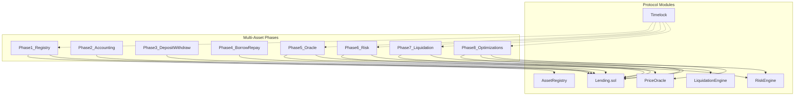

### 15.2 Module × Phase Matrix

| Module | P1 Registry | P2 Accounting | P3 Deposit/Withdraw | P4 Borrow/Repay | P5 Oracle | P6 Risk | P7 Liquidation | P8 Production |
| :--- | :--- | :--- | :--- | :--- | :--- | :--- | :--- | :--- |
| **Lending.sol** | Read registry | Nested mappings | ERC-20 + ETH supply | Multi-asset borrow/repay | USD portfolio valuation | Portfolio HF checks | Cross-asset liquidate | Indexes, flash loans |
| **AssetRegistry** | **Created** | — | Collateral type check | Borrowable type check | Enable requires feed | Enable requires risk params | Decimals for seizure | E-Mode / isolation flags |
| **PriceOracle** | Decimals reference | — | — | — | **Feed registry** | — | Cross-asset prices | Peg bands, TWAP |
| **RiskEngine** | assetType metadata | — | Supply cap stub | Borrow cap stub | USD inputs from Lending | **Per-asset params** | HF liquidation gate | E-Mode, isolation |
| **LiquidationEngine** | Decimals reference | — | — | — | Price inputs via Lending | HF aggregation | **Cross-asset seizure** | Dynamic bonus/factor |
| **Timelock** | Asset listing | — | — | — | Feed registration | Risk param updates | Liquidation params | Rate models, fees |

### 15.3 Cross-Module Call Graph (Target State)

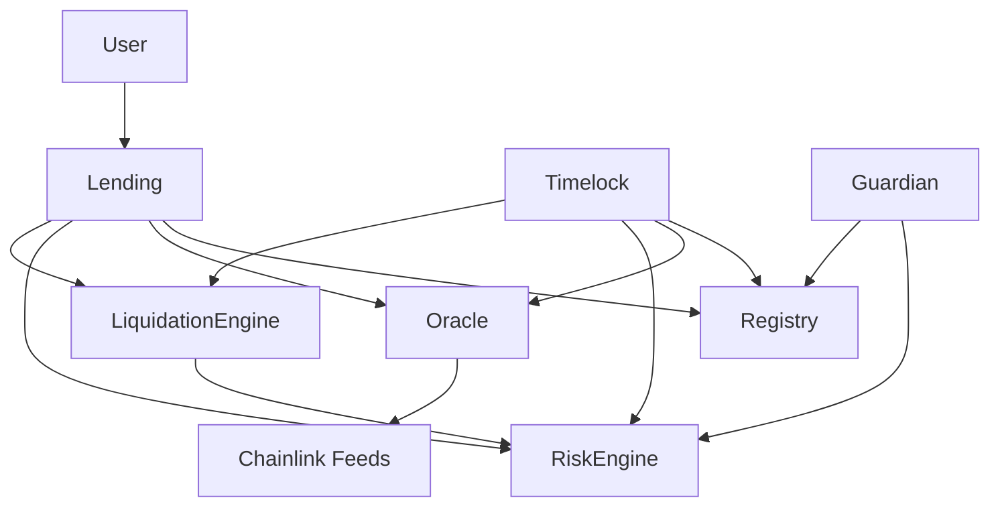

### 15.4 User Journey — Cross-Asset End State

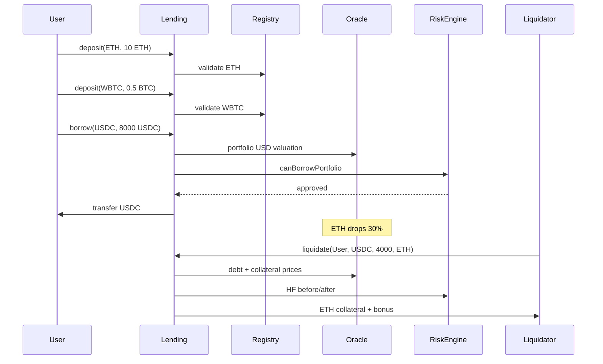

### 15.5 External Documentation Dependencies

| This Phase | External Blueprint Section |
| :--- | :--- |
| Phase 5 | [PRICE_ORACLE.md §5–6](./PRICE_ORACLE.md) — Multi-asset feed registry, portfolio valuation |
| Phase 7 | [LIQUIDATION_ENGINE.md §6](./LIQUIDATION_ENGINE.md) — Multi-asset liquidation |
| Phase 6 | [RISK_ENGINE.md §5–10](./RISK_ENGINE.md) — HF framework (superseded by per-asset params) |
| Phase 8 Oracle | [PRICE_ORACLE.md §8–9](./PRICE_ORACLE.md) — Circuit breakers, institutional |
| Phase 8 Liquidation | [LIQUIDATION_ENGINE.md §7–8](./LIQUIDATION_ENGINE.md) — Dynamic liquidation |

---

## 16. Testing Pyramid

Multi-asset testing extends the existing baseline in `test/unit/`, `test/fuzz/`, and `test/invariant/`.

### 16.1 Layer Definitions

| Layer | Scope | Location (Suggested) | When Added |
| :--- | :--- | :--- | :--- |
| **Unit** | Single function / contract isolation | `test/unit/registry/`, `test/unit/lending/multi/` | Each phase |
| **Integration** | Multi-contract user journeys | `test/integration/multi/` | Phase 3+ |
| **Fuzz** | Randomized inputs, decimal boundaries | `test/fuzz/MultiAssetFuzz.t.sol` | Phase 2+ |
| **Invariant** | Protocol-wide properties over time | `test/invariant/MultiAssetInvariants.t.sol` | Phase 3+ |
| **Fork** | Real Chainlink feeds on testnet | `test/fork/` | Phase 5+ |

### 16.2 Phase-Specific Test Gates (Release Criteria)

| Phase | Must Pass Before Merge |
| :--- | :--- |
| 1 | All registry unit tests; ETH flows unchanged |
| 2 | Migration tests; existing lending unit tests green |
| 3 | ERC-20 deposit/withdraw; `totalSupply` invariant |
| 4 | Same-asset + cross-asset borrow (flagged); repay refund |
| 5 | Decimal matrix; portfolio USD; stale revert |
| 6 | Portfolio LTV; per-asset caps; pause matrix |
| 7 | Cross-asset liquidation E2E; HF improvement |
| 8 | Index monotonicity; flash loan; E-Mode; isolation |

### 16.3 Test Utilities (Suggested)

| Utility | Purpose |
| :--- | :--- |
| `MultiAssetTestBase.t.sol` | Deploy registry, mock tokens (6/8/18 dec), mock feeds |
| `MockERC20.sol` | Configurable decimals |
| `PortfolioBuilder.sol` | Helper to set up multi-asset positions in tests |
| `PriceDropHelper.sol` | Simulate oracle price change for liquidation tests |

### 16.4 Regression Policy

Every phase must maintain **100% pass rate** on prior phase regression suite. No phase may merge with failing ETH-only tests unless explicitly deprecated and documented.

---

## 17. Global Invariants

These invariants apply across the full multi-asset system after Phase 7 (Phase 8 adds index-specific invariants from §14).

### 17.1 Accounting Invariants

```text
GLOBAL-1: ∀ asset a: reserves[a].totalSupply == Σ_u userPositions[u][a].deposited
          (using actual or scaled-to-actual balances)

GLOBAL-2: ∀ asset a: reserves[a].totalBorrow == Σ_u getTotalDebt(u, a)

GLOBAL-3: ∀ asset a: reserves[a].totalLiquidity <= tokenBalance(lending, a)
          (ETH: address(lending).balance)

GLOBAL-4: reserves[a].totalLiquidity + reserves[a].totalBorrow
          == total tokens supplied to pool (conservation, modulo treasury)
```

### 17.2 Risk Invariants

```text
GLOBAL-5: Successful borrow ⟹ totalDebtUsd <= maxBorrowUsd (portfolio)

GLOBAL-6: Successful withdraw with debt ⟹ HF >= minHealthFactor

GLOBAL-7: Successful liquidation ⟹ HF_after > HF_before

GLOBAL-8: Disabled or unregistered asset ⟹ no new deposits or borrows
```

### 17.3 Oracle Invariants

```text
GLOBAL-9: Oracle paused or asset price stale ⟹ all risk-mutating ops revert

GLOBAL-10: Portfolio USD == sum of per-asset USD (linear valuation)
```

### 17.4 Registry Invariants

```text
GLOBAL-11: assetCount == assetList.length

GLOBAL-12: enabled asset ⟹ isRegistered ∧ hasAssetParams (Phase 6+) ∧ feedRegistered (Phase 5+)
```

### 17.5 Extends Existing Invariant

Current [`test/invariant/LendingInvariants.t.sol`](test/invariant/LendingInvariants.t.sol):

```solidity
assertEq(lending.totalLiquidity(), address(lending).balance);
```

Multi-asset extension:

```text
GLOBAL-13: ∀ asset: reserves[asset].totalLiquidity <= balanceOf(asset)
GLOBAL-14: ETH sentinel liquidity == address(lending).balance (legacy compat)
```

---

## 18. Migration Checklist

Ordered steps to transition from current single-asset deployment to multi-asset production.

### 18.1 Pre-Migration

- [ ] Fix `liquidationEngine` constructor wiring (can ship pre-migration as hotfix)
- [ ] Fix liquidation `totalSupply` accounting in single-asset mode
- [ ] Complete single-asset liquidation integration tests
- [ ] Transfer ownership of Oracle, Risk, Registry to Timelock
- [ ] Document emergency pause runbook

### 18.2 Phase Rollout Sequence

| Step | Action | Dependency |
| :--- | :--- | :--- |
| 1 | Deploy `AssetRegistry`; register ETH sentinel (`address(0)`) | Timelock live |
| 2 | Deploy Lending V2 with Phase 2 storage OR upgrade proxy | Registry address |
| 3 | Run migration script: `users[user]` → `userPositions[user][ETH]` | Step 2 |
| 4 | Verify GLOBAL-1..14 for ETH-only | Step 3 |
| 5 | Register WETH, WBTC, LINK, USDC, DAI in registry (disabled) | Step 1 |
| 6 | Register Chainlink feeds in PriceOracle (Phase 5) | Step 5 |
| 7 | Set per-asset risk params in RiskEngine (Phase 6) | Step 5 |
| 8 | Enable assets one-by-one via Timelock | Steps 6–7 |
| 9 | Deploy updated LiquidationEngine; wire in Lending (Phase 7) | Steps 5–8 |
| 10 | Enable `crossAssetBorrowEnabled` | Steps 6–8 |
| 11 | Monitor first 72h per asset; guardian on standby | Step 8 |
| 12 | Phase 8 production features per governance roadmap | Step 9 stable |

### 18.3 Migration Script Requirements (Conceptual)

```text
migrateUser(address user):
    legacy = users[user]
    if legacy.deposited == 0 && legacy.borrowed == 0: return
    userPositions[user][ETH_SENTINEL] = legacy
    update reserves[ETH] totals
    populate collateral/debt lists
    emit StorageMigrated(...)

postMigrationVerify():
    assert GLOBAL-1..14 for all migrated users
    assert sum(reserves[ETH]) matches legacy globals
```

### 18.4 Rollback Plan

| Failure | Response |
| :--- | :--- |
| Oracle price wrong on new asset | Guardian disable asset in registry + oracle |
| Unexpected HF behavior | Pause borrow on affected asset |
| Liquidation failure | Pause liquidation; manual governance resolution |
| Critical exploit | Global pause; Timelock upgrade or migration to patched impl |

### 18.5 Integrator Breaking Changes

| Change | Impact |
| :--- | :--- |
| `users(address)` getter removed | Update to `userPositions(user, asset)` |
| `Liquidated` event adds asset params | Update indexers |
| Global caps → per-asset caps | Update monitoring dashboards |
| `totalSupply()` → `reserves(asset).totalSupply` | Update analytics |

---

## 19. Audit Focus Areas

Priority audit targets for multi-asset launch (Phase 7 minimum, Phase 8 recommended).

### 19.1 Critical Severity

| Area | Question for Auditors |
| :--- | :--- |
| Decimal normalization | Can rounding be exploited to borrow without sufficient collateral? |
| Cross-asset liquidation | Is seized collateral always ≤ fair value of repaid debt + bonus? |
| Oracle fail-closed | Can stale/zero price allow undercollateralized borrow? |
| Reentrancy | Can ERC-20 hooks re-enter borrow/liquidate/flashLoan? |
| Portfolio HF | Is weighted LT aggregation implemented identically in borrow, withdraw, liquidate? |

### 19.2 High Severity

| Area | Question |
| :--- | :--- |
| `totalSupply` on liquidation | Does seizure always decrement reserve supply? |
| Close factor bypass | Can liquidator repay more than close factor via rounding? |
| Asset registry gate | Can unregistered tokens enter userPositions? |
| Interest accrual | Does totalBorrow match sum of user debts after accrual? |
| Cap enforcement | Can borrow exceed per-asset borrowCap via multi-tx split? |

### 19.3 Medium Severity

| Area | Question |
| :--- | :--- |
| Enumeration griefing | Can attacker inflate user asset lists for gas DoS? |
| Migration script | Are legacy users fully migrated without balance loss? |
| Timelock bypass | Can owner execute without delay on critical ops? |
| E-Mode / Isolation (Phase 8) | Can user escape constraints via asset ordering? |
| Flash loan fee | Can fee be bypassed via balance manipulation? |

### 19.4 Economic / Game Theory

| Scenario | Analysis Required |
| :--- | :--- |
| Oracle manipulation + borrow | Single-block profit possible? |
| Self-liquidation | Profitable via bonus + price manipulation? |
| Stablecoin depeg | Protocol exposure at USDC = $0.50 |
| Utilization spike (Phase 8) | Rate model stability at 100% utilization |
| Empty market attack | First depositor manipulation |

### 19.5 Storage / Upgrade

| Topic | Note |
| :--- | :--- |
| Proxy pattern | Storage gap collision if upgrading from single-asset impl |
| Nested mapping layout | Verify slot assignment in upgrade diff |
| Deprecated getters | Ensure legacy aliases cannot desync from reserves |

---

## 20. Alignment With Existing Docs

| Document | Relationship to This Blueprint |
| :--- | :--- |
| [LENDING_PROTOCOL.md](./LENDING_PROTOCOL.md) | **Master architecture document** — protocol-wide status, Phases 7–12 roadmap, module status. This file is the **multi-asset implementation detail** only. |
| [PRICE_ORACLE.md](./PRICE_ORACLE.md) | Blueprint Phase 5 implements oracle-side; Oracle doc Phase 2+ for feed registry |
| [LIQUIDATION_ENGINE.md](./LIQUIDATION_ENGINE.md) | Blueprint Phase 7 implements cross-asset liquidation; Liquidation doc Phase 4+ |
| [RISK_ENGINE.md](./RISK_ENGINE.md) | Blueprint Phase 6 extends V3 to per-asset portfolio risk |
| [TIMELOCK.md](./TIMELOCK.md) | Governance delay for registry, oracle, risk, and liquidation admin |

### Protocol Phase Mapping

| LANDING_PROTOCOL Phase | MULTI_ASSET_LENDING Phases |
| :--- | :--- |
| Phase 7 — Multi-Asset Lending | Phases 1–4 |
| Phase 8 — Cross-Asset Liquidation | Phases 5–7 |
| Phase 9–10 — Fees & Reserve Factor | Phase 8 (partial) |
| Phase 11 — Isolation Mode | Phase 8 + §5.11 |
| Phase 12 — E-Mode | Phase 8 + §5.12 |

### Recommended Reading Order for Implementers

1. [LENDING_PROTOCOL.md](./LENDING_PROTOCOL.md) — current status and prerequisites (Phase 6 liquidation integration must complete first)
2. This document — Part 0 and phase dependencies
3. Phase-specific sibling doc (oracle / risk / liquidation) before implementing blueprint Phases 5–7
4. Part 3 of this document — testing and audit before each mainnet asset enable

---

## Appendix A — Default Asset Parameters (Suggested Launch Values)

| Asset | Decimals | LTV | Liq. Threshold | Supply Cap | Borrow Cap | Stablecoin |
| :--- | :--- | :--- | :--- | :--- | :--- | :--- |
| ETH | 18 | 80% | 82.5% | governance | governance | No |
| WBTC | 8 | 70% | 75% | governance | governance | No |
| LINK | 18 | 65% | 70% | governance | governance | No |
| USDC | 6 | 80% | 85% | governance | governance | Yes |
| DAI | 18 | 80% | 85% | governance | governance | Yes |

*Values are illustrative. Production values require risk analysis and governance approval.*

---

## Appendix B — Glossary

| Term | Definition |
| :--- | :--- |
| **Reserve** | Per-asset liquidity pool within the protocol |
| **RAY** | 1e27 precision used for index math (Aave convention) |
| **LTV** | Loan-to-value; max borrow as % of collateral value (`maxBorrowRatio`) |
| **Liquidation Threshold** | Collateral haircut weight in HF numerator |
| **HF** | Health Factor; `< 1e18` means liquidatable |
| **Close Factor** | Max % of debt liquidatable per transaction |
| **Liquidation Bonus** | Extra collateral paid to liquidator as incentive |
| **E-Mode** | Efficiency mode; higher LTV for correlated assets |
| **Isolation Mode** | Restricted borrowing against single collateral with debt ceiling |
| **ETH Sentinel** | `address(0)` representing native ETH in mappings |
| **Portfolio HF** | HF computed across all user collateral and debt assets |

---

## Appendix C — Phase Summary Table

| Phase | Name | Primary Deliverable | Enables |
| :--- | :--- | :--- | :--- |
| 1 | Asset Registry | Canonical asset catalog | Validated asset keys |
| 2 | User Accounting | Nested mappings + reserves | Multi-asset storage |
| 3 | Deposit/Withdraw | ERC-20 + ETH collateral supply | Multi-collateral |
| 4 | Borrow/Repay | Per-asset debt + interest | Multi-asset debt |
| 5 | Oracle Integration | Per-asset USD pricing | Cross-asset solvency math |
| 6 | Risk Engine | Per-asset LTV + portfolio HF | Safe cross-asset borrow |
| 7 | Liquidation | Cross-asset seizure | Bad debt resolution |
| 8 | Production Optimizations | Indexes, E-Mode, flash loans | Mainnet-scale TVL |

---

*End of Multi-Asset Lending Architecture Blueprint.*

*Implementation PRs should reference the blueprint phase section they satisfy and update [LENDING_PROTOCOL.md](./LENDING_PROTOCOL.md) when protocol-wide status changes.*

### Document Maintenance

Keep this blueprint synchronized with [LENDING_PROTOCOL.md §13](./LENDING_PROTOCOL.md#13-document-maintenance). When multi-asset code ships, update both the master doc Phase 7+ status and the relevant section in this file — do not mark phases complete here until completion criteria in LENDING_PROTOCOL are met.

